# Lesson 02: Foundations of the technology stack: HTML, CSS, and JS

## TOC

  - [Overview](#overview)
  - [Understanding the HTML document and Document Object Model (DOM)](#understanding-the-html-document-and-document-object-model-dom)
    - [using the browser development tools to understand the DOM](#using-the-browser-development-tools-to-understand-the-dom)
  - [Structuring content with HTML](#structuring-content-with-html)
    - [the heading elements](#the-heading-elements)
    - [the paragraph element](#the-paragraph-element)
    - [the image element](#the-image-element)
    - [the hyperlink element](#the-hyperlink-element)
    - [the list element](#the-list-element)
    - [division element](#division-element)
  - [Selecting and styling markup with CSS rules](#selecting-and-styling-markup-with-css-rules)
    - [selecting and styling native HTML elements](#selecting-and-styling-native-html-elements)
    - [selecting and styling elements using id and class attributes](#selecting-and-styling-elements-using-id-and-class-attributes)
  - [Controlling behavior with JavaScript](#controlling-behavior-with-javascript)
    - [logging JavaScript to the browser developer tools console](#logging-javascript-to-the-browser-developer-tools-console)
    - [Using JQuery](#using-jquery)
  - [Commenting your code](#commenting-your-code)

## Overview 

This lesson will provide you with an introduction to the foundational technology stack used in web map development. We will introduce you to 3 separate coding technologies (HTML, CSS, and JavaScript), which work together to produce a web page and map application. The module suggests that web map design is achieved using these three technologies to structure **content** (HTML), and give **form** (CSS) and **behavior** (JavaScript) to this content. Design is then the convergence of content, form, and behavior.

Additionally, we'll practice writing these technologies within our powerful text editor, Brackets, as well as using in browser development tools to inspect the Document Object Module (DOM) and debug our code. 

The lab assignment for this lesson will consist of following task instructions listed within this lesson. **You should read the 
[Lab 02: Building a DOM with HTML, CSS, and Javascript](lab-02/lab-02.md) instructions before continuing with this lesson.**

## Understanding the HTML document and Document Object Model (DOM)

Open the entire module-02 directory in Brackets (i.e., with Brackets open, go to **File -> Open Folder**). Double-click on the *index.html* file so that it opens within your **Working Files**. We'll use this basic template within this lesson.

Note that to complete this module and lab assignment, you'll have needed to follow the instructions detailed at the end of module 01 for using Git within this course. For this module, you'll want to first pull down any updates to our remote *map672-s16* repository to your local copy of our repo, and then manually copy any new directories into your personal *map672* repository. Commit these changes and then begin.

While you could simply open this *index.html*  in your web browser (we recommend developing either in Chrome or Firefox), we're going to take advantage of the **web server** capabilities within Brackets. Instead of just reading the contents of the file, we want our browser to make what's known as an "HTTP request" for the file, and for that file to be "served" back to the browser with a response. 

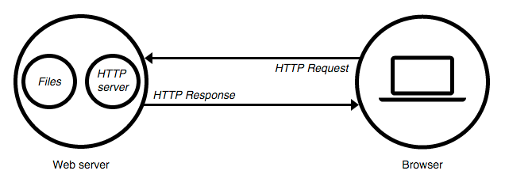

Figure 01. Model of the HTTP request and response of the web server

This is how webpages you look at on the web get delivered to your local web browser. There's a remote (vs local) web server handling the request. We don't really need to technically grasp how this works at the moment. You can read more about [What is a web server?](https://developer.mozilla.org/en-US/Learn/What_is_a_web_server).

The important thing to understand here is the difference between our web browser reading the file from a location on our hard drive (e.g., *file:///Users/NewMaps/Documents/map672/module-02/lesson-02-data/index-01.html*) and our browser making this HTTP request from a local web server. Brackets provides such a capability.

To do this, and with your *index.html* selected within your **Working Files**, click the lightening bolt in the upper right corner of Brackets (or go to **File -> Live Preview**). This will open the document with a local web server. Note that the URL in the browser is not a relative path to a location on the computer (i.e., *ile:///Users/NewMaps/Documents/...*), but rather it's a URL that looks like *http://127.0.0.1:50090/module-02/lesson-02-data/index-01.html*. Pay attention through out this course and make sure you're seeing this *http://127.0.0.1:50090/* within your URL. Otherwise, the page may be served incorrectly.

Note that we currently have a visually underwhelming webpage: a bunch of plain black text on a white background, with one fairly cool looking map.

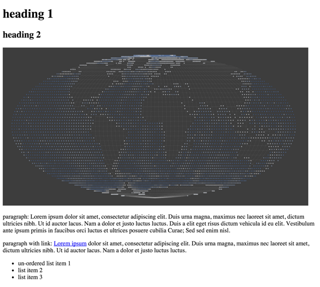

Figure 02. Basic template webpage

Before we move forward to begin learning what all the HTML is doing, let's acquaint ourselves with another piece of our development toolkit: browser developer tools. We'll use these tools to consider the **Document Object Model**, or **DOM**. It's a bit challenging to get it at first, so we'll give a brief definition here and then continue to understand what the DOM is through use and inspection with the developer tools.

The DOM is an interface between all the technologies that come together to produce our webpage, and it provides a structured representation of our webpage. It is hierarchical and consists of nested node objects (parent nodes and child nodes). These nodes all have particular characteristics  and behaviors. For instance, within our starter template *index.html* page, the large text at top that says "heading 1" is a node. It has a certain size and color, and it is position "above" the rest of the visual elements.

Another way to think of nodes is as **objects** with characteristics (or properties) and behaviors (or methods). The power of the DOM lies in our ability to select particular nodes, or objects, and do something with them. We'll be doing this below using CSS and JavaScript.

Read more about the [Document Object Model](https://developer.mozilla.org/en-US/docs/Web/API/Document_Object_Model) and the [Introduction to the DOM](https://developer.mozilla.org/en-US/docs/Web/API/Document_Object_Model/Introduction).

### using the browser development tools to understand the DOM

Modern web browsers are equipped with powerful tools for helping us develop our web applications. These are known as browser developer tools, which are useful for letting us look "beneath" the webpage, as well as letting our JavaScript "talk" to our web browser through what's known as the JavaScript Console.

For many years, development tools and a JavaScript Console existed as additional plugins that web designers and developers could install in their browser. Most modern browsers of today (i.e., Chrome, Firefox, Safari, IE10+) come with these tools built into the browser itself. We'll be exploring these tools in greater detail through the course, but for now, we want to get to know our browser JavaScript Console. 

We're going to demonstrate using Chrome's (though Mozilla Firefox's developer tool is great as well). Read more about using the [JavaScript Console in Chrome](https://developer.chrome.com/devtools/docs/console).

With your *index.html* open using the **Live Preview** of Brackets, access the **developer tools** through the options (upper-right corner of Chrome).

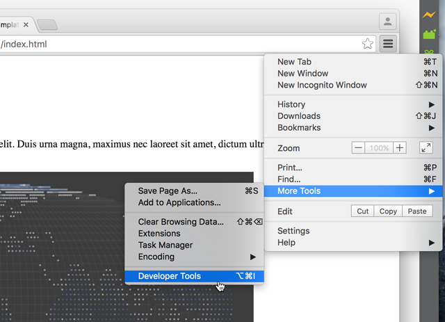

Figure 03. Opening the developer tools within Chrome

By default the developer tools open alongside the bottom of your browser window. You can move the window to display along the side, or as a separate window. Drag the tools up to increase the height and be sure the **Elements** tab is active at the left, along the row of options at the top.

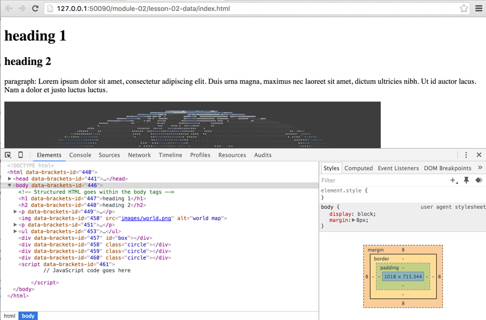

Figure 04. Chrome's developer tools open

If we carefully compare our HTML in the *index.html* file with what's presented within the developer tools, we can see they match. Brackets has dynamically inserted a bunch of it's own code into it, but we can just ignore that (i.e., anything beginning with "data-brackets").

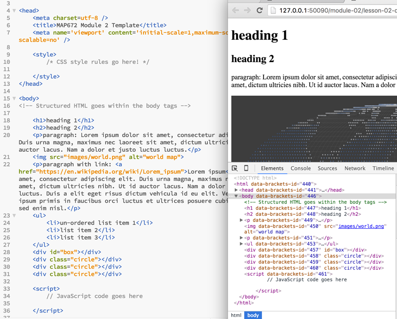

Figure 05. Visually comparing the static HTML text with the rendered elements in the DOM

The text within our *index.html* file is simply plain-text. It is not the DOM. But, once that HTML is rendered within the browser, it becomes part of the DOM. We know the order in which elements are rendered in the browser, which elements are child nodes of parent objects. And most importantly, we can use a dynamic programming language such as JavaScript to manipulate the objects within the DOM.

Let's now get our heads around how this content is being structured with HTML.

## Structuring content with HTML

HTML, an acronym for HyperText Markup Language, comprises the basic building blocks of a webpage. It is not considered "code," and it is not a programming language. Rather, it is a "markup language" used to structure content (e.g., text, images, audio, video, etc). To do so, it uses a set of elements to define various content types (e.g., a heading, paragraph, or list).

Elements are written within "tags" that contain the content. These HTML tags are enclosed by angled brackets. The closing tag begins with a forward slash. 

Let's look at a minimal HTML document and consider the tags within it. Compare this document with the *index.html* file you've opened in Brackets to identify the similar elements.

```html
<!DOCTYPE html>
<html lang="en">
  <head>
    <title>title</title>
  </head>
  <body>
    <!-- page content -->
  </body>
</html>
```

Very briefly:

* The first line of the document simply tells web browsers which version of HTML the document contains (this is HTML5, the latest specification). 
* After that, the entire document is enclosed within the two &lt;html&gt;&lt;/html&gt; tags.
* Content enclosed between the &lt;head&gt;&lt;/head&gt; tags is not displayed with the webpage. The &lt;head&gt; element contains metadata about the document, including its title, as well as links to external resources such as stylesheets and JavaScript scripts.
* The &lt;body&gt;&lt;/body&gt; tags contain all the elements that may appear visually on the web page, and may contain additional scripts that are not rendered for the user but still affect the web page

Let's return to our *index.html* template page to investigate the content within these &lt;body&gt;&lt;/body&gt; tags. Here we'll cover only a few of the more commonly used HTML tags here. You'll want to consult additional resources, such as the Mozilla Developer Network's [HTML element reference](https://developer.mozilla.org/en-US/docs/Web/HTML/Element). Other useful resources include

* the [w3schools HTML(5) Tutorial](http://www.w3schools.com/html/default.asp)
* searching for answers on [stackoverflow](http://stackoverflow.com/)

**Tip**: when searching the web for help with web development, it's often useful to prefix "mdn" to your search query, which will help identify the high-quality resources produced through the [Mozilla Developer Network](https://developer.mozilla.org/en-US/).

### the heading elements

While the &lt;title&gt;&lt;/title&gt; tags in the head of the document enclose the title of the HTML document (which is displayed in the browser tab and used by search engines to identify the content of the page), a well-structured HTML document uses headings to hierarchically organize the content.

Consider &lt;h1&gt; and  &lt;h2&gt; elements, which represent the heading 1 and heading 2, whereby the heading 2 is a sub-heading of heading 1. Conventionally, the &lt;h1&gt; element was only used once in an HTML document, but this "rule" has changed since the release of HTML5 a few years ago, and you may see a new &lt;h1&gt; element within each new  &lt;section&gt; element (a generic tag used to enclose meaningful sections of content).

Read more about [heading elements](https://developer.mozilla.org/en-US/docs/Web/HTML/Element/Heading_Elements).

**TASK 1:** Edit the heading content of the h1 and h2 tags within your *index.html* document. Make up a title for the map image provided, within the h1 tag. Then provide a fun, informative subtitle for the map within the h2 tag.

The live preview used by Brackets may automatically update this content within the web browser as you type. You may also need to refresh your browser to see the updated results (Command/Cntrl + R).

**Tip:** there's no need to click the lightening bold and open a new Live Preview window every time you make a change or update your document. Simply switch back and forth between Brackets and your web browser, and refresh your browser to see the changes.

### the paragraph element

The &lt;p&gt; element is used to represent paragraphs of text.

Read more about [paragraph elements](https://developer.mozilla.org/en-US/docs/Web/HTML/Element/p).

**TASK 2:** Edit the content within the first paragraph tags of the *index.html* document. Write a short paragraph in response to the following excerpt from page 80 of John Pickles' (2004) *[A History of Spaces: Cartographic Reason, Mapping and the Geo-Coded World](https://books.google.com/books/about/A_History_of_Spaces.html?id=BGJTas8fnpYC)*, and consider the map image within the web page.

>THE CARTOGRAPHIC GAZE [...] has come to see itself as a technical-scientific practice of representing (mirroring) nature. It has accepted a universalist logic, underpinned by commitments to particular forms of parametric space, geometry and scale. It is, above all, a controlling gaze rendering the broad swaths of worldly complexity and enormity in miniature form for a discrete purpose. And, as the history of mapping demonstrates, the ordering principles of the cartographic gaze have always had political intent and/or consequences. The cartographic gaze is dominated by a commitment to modeling a God's-eye view, what Donna Haraway (1991) called the 'God-trick'. This transcendental positioning is both the view from above, an elevated two-point perspective bird's-eye-view, *and* an all seeing eye that views everywhere at the same time.

### the image element

The map image being displayed within this document is a PNG file named *world.png* stored in a subdirectory named *images*. The image is displayed via an image element using the tag &lt;img&gt;.

```html

```

Note that the image element has no closing tag. There are a few HTML elements that use what's known as "self-closing" tags, and the &lt;img&gt; tag is one of these. This tag also contains two **attributes**. Attributes are additional values attached to an element that relate to or affect it in some way. In this case, the image element tag needs to know where to find the image to display. This is achieved through the <code>src</code> attribute, or the URL of embeddable content. Attributes are followed by an equals sign and the value assigned to it, which is generally in quotations. Here in this example, we're telling the image element to look for a file named *world.png* in a directory named *images*. 

This particularl URL path is a **relative path**. That is, it navigates through the file/directory structure from the current location of the *index.html* file. This is opposed to an **absolute path**, which would locate a particular file or directory from an absolute point of reference, such as a base URL (i.e., *http:// ...*). An example of such an absolute path is <code>https://developer.mozilla.org/en-US/docs/Learn</code>.

It's also a good idea to include the <code>alt</code> attribute with the image element, and provide a description of the image. This text will appear in the event that the image fails to load. It is also used by those with visual impairments who use a screen reader.

Read more about the [image element](https://developer.mozilla.org/en-US/docs/Web/HTML/Element/img) and [element attributes](https://developer.mozilla.org/en-US/docs/Web/HTML/Attributes).

**TASK 3:** Change the HTML to display a image named *world2.png* instead of *world1.png*.

### the hyperlink element

The key to the web is the ability to link to different HTML documents through the use of hyperlinks. This is achieved through the use of an anchor element (encoded using the &lt;a&gt; tags and the <code>href</code> attribute.

Consider the example hyperlink in the document, contained within the paragraph element content. Here've wrapped the text "Lorem ipsum" within the &lt;a&gt;&lt;/a&gt; tags and provide a URL as the string value for the <code>href</code> attribute. Clicking on that text sends an HTML request to that location.

Note that you'd wouldn't have an empty anchor element; it needs some content within it in order to be "clickable". This content can be any HTML element, such as an image or the text content of any other element (e.g., heading or list tags).

Read more about the[ anchor element](https://developer.mozilla.org/en-US/docs/Web/HTML/Element/a).

**TASK 4:** Add a hyperlink to the first paragraph linking to the [bacon ipsum generator](https://baconipsum.com/), or if you're not a fan of meat, perhaps the [veggie ipsum generator](http://veggieipsum.com/). Note how the "link text", or the text the user actually clicks on, is not the URL address <code>https://baconipsum.com</code>. Rather, it is semantically meaningful text. It is a good practice to make this link text meaningful, when you can.

### the list element

To create lists within HTML, we use a set of nested elements, in this case an unordered list element and individual list item elements within in it (we can create ordered, or numbered, lists using a ordered list element). The actual content (textual or otherwise) is enclosed between the within the &lt;li&gt;&lt;/li&gt; tags.

Read more about [ordered list elements](https://developer.mozilla.org/en-US/docs/Web/HTML/Element/ol) and [list item elements](https://developer.mozilla.org/en-US/docs/Web/HTML/Element/li).

**TASK 5:** Add additional list items to the list, which should include hyperlinks to the following mapping technologies:

* [Leaflet](http://leafletjs.com/)
* [Mapbox](https://www.mapbox.com/)
* [CartoDB](https://cartodb.com/)
* [Data-Driven Documents](http://d3js.org/)

### division element

Beneath the above content we see a few other curious HTML tags, &lt;div&gt;&lt;/div&gt; tags.

```html
<div id="box"></div>
<div class="circle"></div>
<div class="circle"></div>
<div class="circle"></div>
```
The &lt;div&gt;&lt;/div&gt; tags represent a general container for any content, known as a division element. These particular division elements are currently empty, but we're going to use them to demonstrate some CSS rules in the next section.

Importantly, these division elements as written here also contain two of the more important attributes in web and web mapping development: the <code>id</code> attribute and the <code>class</code> attribute.

The  <code>id</code> attribute's value can only be used once within the document and is a unique identifier for that element. In this example, the  <code>id</code> of  <code>box</code> can be used to identify and select that particular element within the DOM.

The value of a <code>class</code> attribute, by contrast, can be applied to more than one element. In this example, there are three division elements that can be identified and selected with the value <code>circle</code>. We can select all of those elements as a group at once with CSS or JavaScript. A selection makes a node or group of nodes accessible for further manipulation, such as changing their size or color properties.

Read more about [division elements](https://developer.mozilla.org/en-US/docs/Web/HTML/Element/div), the [id attribute](https://developer.mozilla.org/en-US/docs/Web/HTML/Global_attributes/id), and the [class element](https://developer.mozilla.org/en-US/docs/Web/HTML/Global_attributes/class).

**TASK 6:** Add a unique identifier to the image element with a value of "map".

## Selecting and styling markup with CSS rules

The second component of design following content is form. Within our web documents, we give form to our content through the use of CSS, a stylesheet language which describes the presentation of HTML. CSS is written as a series of style rules.

We can either write these style rules in an external text document (a file that uses the extension *.css*) or within our HTML document between two <code>`<style`>`</style`></code> tags enclosed within the head element at the top of the document. We can also write style rules directly on elements, but it's best to avoid this practice. Within this course, we'll primarily be writing style rules using the second method, within the head element of our document for simplicity.

CSS is a powerful technology, but difficult to master. It works by first **selecting** an element in the DOM and then declaring various **property** values.

This graphic from the [w3schools](http://www.w3schools.com/css/css_syntax.asp) is useful for understanding the syntax of a CSS rule.


Figure 06. CSS Syntax

Read more about [CSS](https://developer.mozilla.org/en-US/docs/Web/CSS).

Let's now practice writing some CSS rules into our web document. Before we begin, however, we should note that the document is not completely without form; is not completely un-styled. The heading elements are larger than the paragraph elements, and there is space (i.e., margin or padding) around the elements. The hyperlink appears with its classic blue color and an underline. This is because the web browser itself has a default style sheet it applies to these elements (and beware: different web browsers use different style sheets).

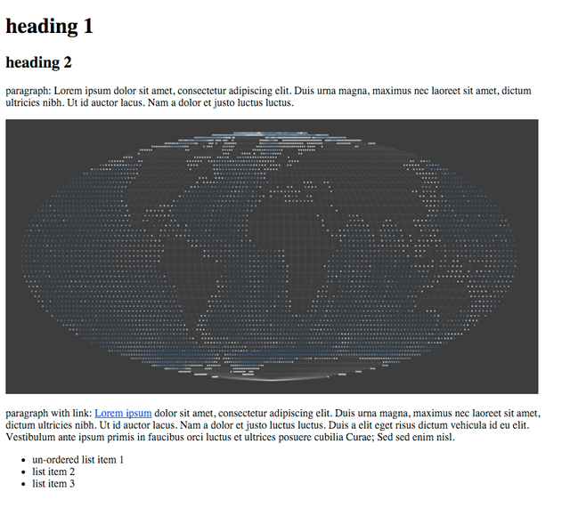

Figure 07. Webpage with the browser's default styles applied


### selecting and styling native HTML elements

We're going to be writing some style rules within the  &lt;style&gt;&lt;/style&gt; tags in the head of our document that will override and augment the default browser style sheet.

```html
    <style>
        /* CSS style rules go here! */
    </style>
```

**TASK 7:** Follow these instructions and edit your document as you read, saving the changes as you go.

Write a CSS rule that selects the body element. We select elements with CSS by simply writing the element's tag name, which is then followed by an opening and closing curly brace. The rules's declarations are then written within these braces, and each declaration always ends with a semicolon.

```html
    <style>
        body {
             /* rule declarations go here! */
        }
    </style>
```
We're going to give the body element's margin and padding properties values of zero, make the body's background color  *#f5f5f5*  (the hex value for a whitesmoke color). We'll also declare the font family to be sans-serif and declare the font color to be *#3d3d3d*;

```css
        body {
            margin: 0;
            padding: 0;
            background: #f5f5f5;
            font-family: sans-serif;
            color: #3d3d3d;
        }
```

Save these changes in Brackets and then refresh your webpage within the web browser. We can see that the background has changed, and the elements are now flush against the left side of the window. The rule is also affecting the typeface of the textual elements within the body tags. This is because these elements are "inheriting" the <code>font-family</code> and  <code>color</code>properties from the body element. CSS works through **inheritance**, which means that elements enclosed within other elements inherit some of their parent's properties (but not all). 

Again, understanding CSS is challenging and takes some time. We're mostly going to focus on JavaScript in the subsequent modules. Here we're just going for a basic working knowledge of what CSS is.

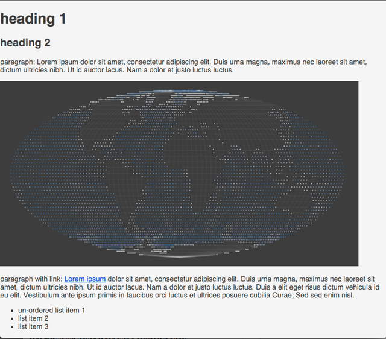

Figure 08. Webpage with body style rule applied

Next, let's add rules that select the heading and paragraph elements and style them. We're going to use the margin properties to push the elements off the left side of the page. We also want to specify font sizes in units of <code>em</code>, which is a relative unit (rather than pixels). We'll also constrain the width of the paragraph elements to be 800px (pixels) wide. Write these below the previous body element rule.

```css
h1 {
    font-size: 1.6em;
    margin-left: 25px;
}
h2 {
    font-size: 1.4em;
    margin-left: 25px;
}
p {
    font-size: 1em;
    margin: 15px 25px;
    max-width: 800px;
}
```
Examine these subtle changes in the web document within your browser by again saving the changes to the file within Brackets and then refreshing the page in your web browser. This will become a very familiar process that you'll repeat indefinitely as a web (map) developer:

1. write code
2. save changes
3. refresh in browser to see changes

Occasionally, this process will be punctuated by committing the saved changes to your Git repository (see module 01).

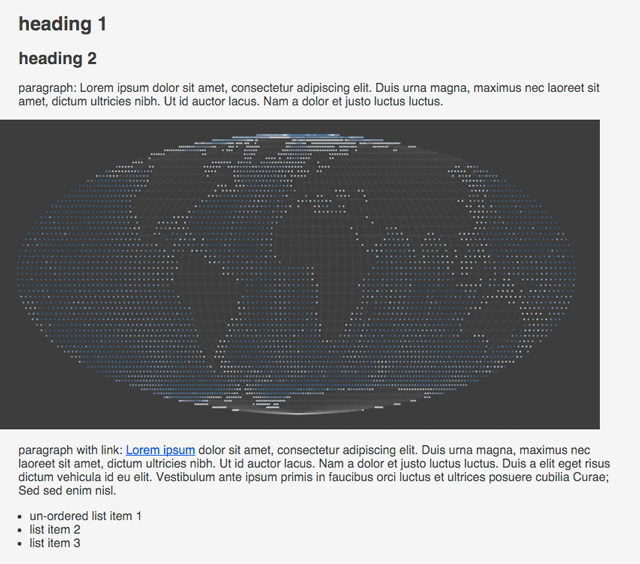

Figure 09. Webpage with heading and paragraph rules applied]

Next we'll style that hyperlink so it's a different color and bold. We're also going to apply what's known as a **pseudoselector** to the anchor element, <code>:hover</code>, which will apply a rule with the user mouses over the element. Let's also use the same technique to push our image 25 pixels off the left edge of its parent element (which is the body element). Continue with the following CSS rules:

```css
a {
    color: #3e6b93;
    font-weight: bold;
    text-decoration: none;
}
a:hover {
    text-decoration: underline;
}
img {
    margin-left: 25px;   
}
```

Save these changes and refresh the browser. Note again the subtle shifts with the margins, as well as the interaction the <code>:hover</code> pseudoselector provides when mousing over the actor tag.

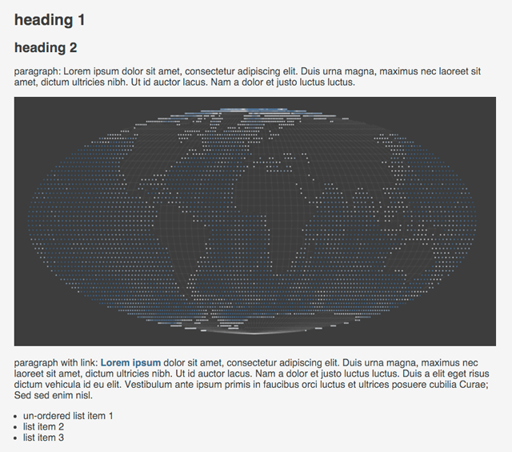

Figure 10. Webpage with anchor and image tags applied

If you're paying close attention, you should be thinking, "Wait! I thought CSS only handled form, and JavaScript handles behavior such as user interaction." It turns out that CSS is powerful and also shoulders some of the behavioral responsibility. This is moreso the case with recently updated specifications of CSS, which include [animations](https://developer.mozilla.org/en-US/docs/Web/CSS/animation) and [transformations](https://developer.mozilla.org/en-US/docs/Web/CSS/transform) of HTML elements.

Now spend some time tweaking the values for the style rules we've written so far to personalize the look and feel of your page. You may want to consult the [w3schools CSS Tutorial](http://www.w3schools.com/css/) to explore some property options.

For instance, we could create some abomination like this:

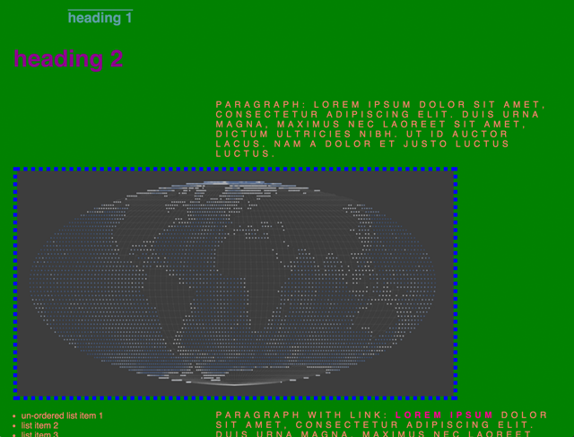

Figure 11. A visual abomination

by tweaking the style rules like so:

```css
 body {
    margin: 0;
    padding: 0;
    background: green;
    font-family: sans-serif;
    color: salmon;
}
h1 {
    font-size: 1.6em;
    margin-left: 125px;
    text-decoration: overline;
    color: cadetblue;
}
h2 {
    font-size: 2.7em;
    margin-left: 25px;
    font-stretch: extra-expanded;
    color: darkmagenta;
}
p {
    font-size: 1em;
    margin: 15px 25px;
    max-width: 60%;
    float: right;
    letter-spacing: .4em;
    text-transform: uppercase;
}
a {
    color: deeppink;
    font-weight: bold;
    text-decoration: none;
}
a:hover {
    text-decoration: underline;
}
img {
    margin-left: 25px; 
    border: 7px dotted blue;
}
```

But we wouldn't want to do that!

### selecting and styling elements using id and class attributes

Let's move on to work with those empty division tags we wrote into the HTML. While we can select all the division elements in the document with a CSS rule beginning with <code>div</code>, we instead want to  achieve two things: 1.) select the unique division element with an identifier of "box", and 2.) select all the division elements that share the class attribute of "circle".

In CSS, we select elements using a unique identifier attribute by using the <code>#</code> sign. So, we can write a style rule such as:

```css
#box {
    width: 200px;
    height: 200px;
    background: #3e6b93;
    margin: 25px;
}
```
This rule's declarations give the element's width and a height properties values of 200px each, the background property a color value of #3e6b93 (a blue hue), and margin values of 25px. The result is a blue square, rendered within the DOM.

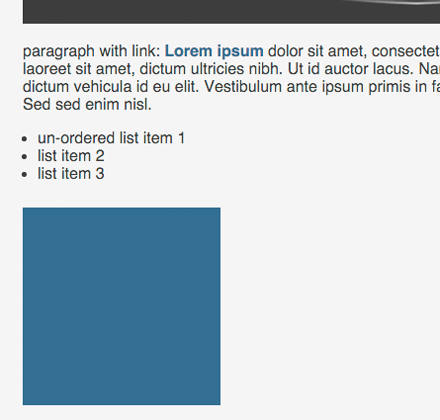

Figure 12. Styling a div to look like a blue box

We can select all the elements with a class of "circle" in a single rule. In CSS, we select elements using a class attribute by using a single period. So, we can write a style rule such as:

```css
.circle {
    width: 100px;
    height: 100px;
    background: #bf6864;
    border-radius: 50%;
    display: inline-block;
    margin: 0 25px;
}
```
This rule gives each of those division elements a width and height, and a mauve background color. Using a 50% value for the <code>border-radius</code> property on a square element produces the effect of a circle. By default, division elements are displayed as block-level elements (meaning they take up space to the width of their parent container, even if they're only being displayed at 100px wide). Changing the <code>display</code> property to <code>inline-block</code> allows them to take up space only as wide as their display width. In this case, it allows the three division elements to sit along side one another. Again, we've added some margin to push the elements apart from each other.

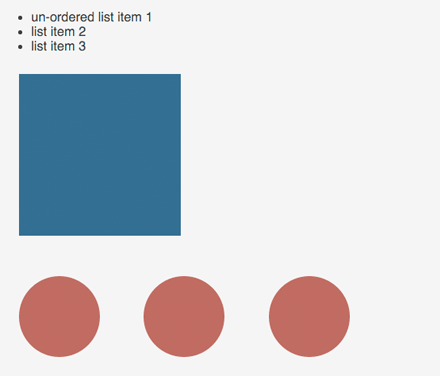

Figure 13. Styling divs to look like mauve circles

That's enough CSS styling practice for now. The rest of this course will be more focused on learning JavaScript specifically. Occasionally, we'll use some CSS rules to help with the display of our map within a web page, or to place elements on a map, so it's good to have a working understanding of how CSS works. Remember, even experienced developers do not have all the properties for every element memorized. Rather we look them up when we need them.

## Controlling behavior with JavaScript

So far we've designed a basic web page using content (HTML) and form (CSS). The final component of a web experience is interaction and event-driven behavioral changes to the elements. To control the behavior within a web document, we will use JavaScript, or JS for short, a programming language used broadly across modern web development today.

We're going to begin learning JavaScript from the ground up, beginning in the next module. For now though, we'll run through some basic examples to demonstrate how JS works with HTML and CSS within interactive web design.

While we may load external JS files within <code>script</code> tags in the head of our document (in a similar ways as an external CSS file), we're going to be writing our custom JavaScript between two <code>script</code> tags at the bottom of our document, directly before the final <code>&lt;/body&gt;</code>tag. 

**TASK 8:** Follow these instructions and edit your document as you read, saving the changes as you go. 

Keep in mind that computers are particularly finicky, and they need things written precisely. Otherwise the program breaks and produces what's known as an **error**. 
Keep your developer tools open within your web browser as you write and test JavaScript. Ensure the **Console** tab is active at the right, along the row of options at the top. 

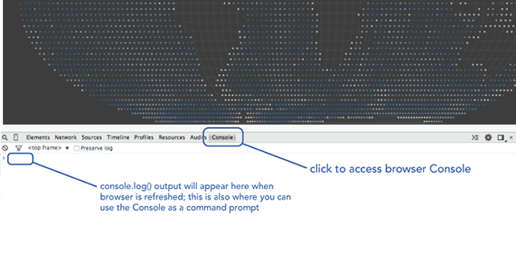

Figure 14. Developer tools with the console tab active

When you refresh your page, you may see JavaScript errors displayed within this Console. Look carefully at those, as they give you clues as to what line of JavaScript you may have not written correctly.

We're now going to write several JavaScript statements to demonstrate some concepts. Don't be alarmed if the code makes no sense. It's not supposed to yet! You can cut and paste the snippets from this document or practice typing them yourself in Brackets. The important thing for now is that you begin to cultivate a quality of looking closely at the JavaScript and ensuring that the syntax and code **match the working example exactly**. Capitalization matters. Dots and hyphens matter. All punctuation matters.

For the following JavaScript examples, write the code into your index.html file, **save the changes**, and then refresh your web page to see the results. Write each example beneath its predecessor, within <code>script</code> tags.

Just like CSS, JavaScript can select elements in the DOM and then manipulate them. JavaScript can even select elements and then apply CSS style rules to them! This first example will select our <code>h1</code> heading and change the text within it:

```javascript
document.querySelector('h1').innerHTML = 'web mapping is sweet!';
```

We can also select an element by its unique identifier. This example selects an element with an <code>id</code> of 'box'. It then stores a reference to this selected element and changes the <code>background </code> style to a new color.

```javascript
var box = document.getElementById('box');
box.style.background = '#4d4a9f'; 
```

JavaScript can also select multiple elements at once using their class name. This example selects all elements with a class name of 'circle', loops through those elements, and changes the border-radius value of each.

```javascript
var elements = document.getElementsByClassName('circle');

for(var i=0; i <= elements.length-1;i++){
    elements[i].style['border-radius'] = '20%';  
}
```

The previous examples ran once the DOM was loaded and the JavaScript was interpreted by the browser. But we can also attach what's known as an "event listener" to elements and wait for some user interaction before doing something. This example attaches a click event listener our previously selected 'box' division and then changes the width of the element.

```javascript
box.addEventListener('click', function() {
    this.style.width = '400px';   
});
```

JavaScript can also create new elements and insert them into the DOM. This example creates a new list item element, inserts some text into it, and then selects our existing unordered list element. The newly created list item is then appended (inserted at the end) of the unordered list.

```javascript
var newListItem = document.createElement('li');
newListItem.innerHTML = "list item 4";
document.querySelector('ul').appendChild(newListItem);
```

### logging JavaScript to the browser developer tools console

Another important feature of the developer tool's Console tab lies in our ability to write messages in JavaScript for this output. We will be doing this often, often during debugging as a way to see when certain lines of the JavaScript are executed or how certain values are calculated. For now, we're simply going to write one line which will output a simple text message to the console.

**TASK 9:** Log the text "hello map" to your browser's Console.

```javascript
console.log("hello map");
```

Save this code and refresh your browser. You should see the text outputted within the Console.

We'll have a better understanding of the specific syntax of this statement when we cover functions and methods in module 6. For now, it's important to note that the opening and closing parenthesis are important. This statement will attempt to log whatever is between them to the JavaScript Console. So, just like html tags or the curly braces of a CSS declaration, it's important to ensure an opening parenthesis is always followed by a closing one.        

### Using JQuery

As we've said, these JavaScript examples are merely to get you acquainted with the development environment and to help you understand how HTML (content), CSS (form), and JavaScript (behavior) work in concert to produce an interactive web page. These examples were written in native JavaScript. Often, however, web developers will use a fabulous JavaScript library which abstracts, or makes simpler and easier, writing Javascript. This library is [JQuery](https://jquery.com/).

To use JQuery, which itself is written in JavaScript code, you need to load it into your DOM. You load the latest version of JQuery from an external server through a Content Delivery Network (CND) within the head of your document by using the <code>`<style`>`</style`></code> tags:

```html
<!DOCTYPE html>
<html>

<head>
    <meta charset=utf-8 />
    <title>MAP672 Module 2 Template</title>
    <meta name='viewport' content='initial-scale=1,maximum-scale=1,user-scalable=no' />
    <script src="https://code.jquery.com/jquery-2.1.4.min.js"></script>
</head>
```

Finally, why do we write our JavaScript at the bottom of the document? We do this because our HTML document is interpreted top to bottom by the web browser, and JavaScript may be seeking to select or manipulate an element within the body element. These elements need to be accessible within the DOM before JavaScript attempts to select them. For instance, in these examples we selected the existing unordered list element and appended a new list item element to it. If that JavaScript had run before the unordered list existed, it would have thrown an error (i.e., the script would have broken).

## Commenting your code

When writing HTML, CSS, or JavaScript, it is often the case that we wish to either write notes for ourselves or others as plain-text (i.e., text that we don't want to be interpreted as code), or we want the browser to temporarily ignore blocks of HTML, CSS, or JavaScript. To achieve this we use what's known as comments. 

Comments are written differently for HTML, CSS, and JavaScript.

Within **HTML**, comments are written with the following syntax: 

<code>&lt;!-- comment goes here -- &gt;</code>.

Within **CSS**, comments are written with the following syntax: 

<code>&#47;&#42; comment goes here &#42;&#47;</code>

And, within **JavaScript**,  comments are written with the following syntax, either for a single line of code: 

<code>&#47;&#47; comment goes here</code>

or for a block of code:

<pre><code>
/*   
box.addEventListener('click', function() {

    // change with width of the element
    this.style.width = '400px';   

}); 
*/
</code></pre>

You'll be commenting code for three reasons within this course. The first two were mentioned above: 1.) to provide plain-text descriptions or notes to yourself and other users of your software to better understand the code, and 2.) to comment out chucks of code you don't want to run, often within the process of debugging.

We'll provide you with further instructions into these use cases for commenting. A third reason you'll be commenting within this course is to show your instructor you understand the code you've written. This will be an overly-verbose form of commenting you wouldn't normally write into production code.

Within Brackets (and other text editors), you should figure out how to quickly comment and uncomment blocks of code. You do this by selecting (highlighting) a large block of text and then toggling the comments on or off (i.e., you don't want to manually write the code opening and closing). See **Edit -> Toggle Line Comment** or **Edit -> Toggle Block Comment**.

## Addition Resources
* [W3C Schools](http://www.w3schools.com/): accessible and useful resource for learning and referencing a variety of web languages (HTML, CSS, JavaScript)
* [CodeAcademy](http://www.codecademy.com/): online, interactive environment for learning a variety of web programming languages such as HTML, CSS, and JavaScript
* [Mozilla Developer Network](https://developer.mozilla.org): comprehensive resource for all things web, including guides and tutorials for [HTML](https://developer.mozilla.org/en-US/docs/Web/Guide/HTML) and [CSS](https://developer.mozilla.org/en-US/docs/Web/Guide/CSS)

## Definitions

* **HTML**: HyperText Markup Language is the text-based markup language used describe all documents (i.e., pages) and document elements on the World Wide Web
* **CSS**: Cascading Style Sheets define how HTML elements are displayed (e.g., their size, color, or position)
* **JavaScript**: the (current) modern programming language of the Web
* **Tag (HTML)**: a component of HTML that represents one node within a hierarchy of nodes, normally composed of an opening and closing tag which contain content within
* attribute: used to provide additional information about an HTML page, normally included within the opening tag (e.g., id, class, href)
* **id (HTML)**: an attribute that specifies a unique identifer for a particular HTML element 
* **class (HTML)** an attribute that specifies a class (i.e., similar category) for a number of HTML elements, allowing CSS rules to be uniformly appled to them
* **Selector (CSS)**: allows CSS to “find” HTML elements based on an attribute such as an id or class, and to apply style rules or otherwise manipulate the element (as through JavaScript)
* **Declaration (CSS)**: component of a CSS rule comprising a property (e.g., color) and a corresponding value (e.g., blue)
