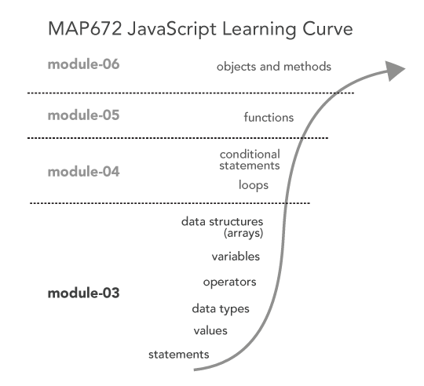

# Lesson 03: The Building Blocks of Programming: Statements, Expressions, Data Types, Operators, Variables, and Array Data Structures

In the previous module learned how to use HTML tags to structure our content within a webpage, and how to apply CSS style rules to modify the form of this content, or how that content looks (e.g., color, size, etc). These two elements, **content** and **form**, and the relationship between them, constitute two fundamental aspects of traditional design. Within the web environment we are able to introduce a third aspect to this classic understanding of design: that of **behavior**, which helps promote user interaction. In web mapping and web development in general today, the behavior of a web page or entities within it are controlled by the programming language JavaScript.

This module begins developing a foundation in computer programming using JavaScript. While we will quickly apply these practices to web mapping, you first need to gain an understanding of the basics of JavaScript, which can be largely applied to web development in general. If you already know a programming language, then you may find these easy to pick up, though you'll gain from learning the specific syntax with which we write JavaScript, as well as its nuances. If JavaScript is your first programming language, you'll be pleased to know that these programming fundamentals are not unique to JavaScript, but can be applied to the other programming languages as well.

## TOC

- [Where we are headed](#where-we-are-headed)
- [Dealing with frustration](#dealing-with-frustration)
- [Sync your local repository with the remote](#sync-your-local-repository-with-the-remote)
- [The atomic elements of programming](#the-atomic-elements-of-programming)
    - [Values and types](#values-and-types)
    - [Expressions and operators](#expressions-and-operators)
    - [Variables](#variables)
    - [Array data structures](#array-data-structures)
    - [Constructing an Array literal](#constructing-an-array-literal)
    - [Accessing Array values](#accessing-array-values)
    - [Updating and adding values to an Array](#updating-and-adding-values-to-an-array)
- [Relevant Reading and Additional Resources:](#relevant-reading-and-additional-resources)
- [Glossary](#glossary)
    
## Where we are headed

Take a look at the overall learning curve/trajectory (Figure 01). Over the next four modules we're going to climb the steepest part of the programming learning curve. The terms listed along the curve will become quite familiar to you. These are not unique to JavaScript, but constitute the building blocks of most programming languages.

  
**Figure 01**. The JavaScript Learning Curve as instructed in MAP672

By the end of these modules, you'll be comfortable using the terms listed within this figure and understand how they all relate together to make the program run.

## Dealing with frustration

**A word of caution before we begin:** Learning to program a computer is not easy. A good analogy is that, like learning a spoken or written language language, you have to first learn its general grammar and the specific syntax with which it is written. Then you go out and make a fool of yourself by incorrectly formulating sentences. Great fun! 

Unfortunately, computers aren't as forgiving for small mistakes as when practicing a spoken or written language. We need to be very careful when we write our code, and as often as we can, write the code **exactly as the examples do.** Pay close attention to whether there are spaces, underscores, capital letters, and semicolons in a line of code. Uppercase and lowercase do matter. Even one wrong character may produce an error and break your script!

However, the good news is that writing bugs into our programs and generating errors is a key part of both learning to program and programming itself. Why is this good news? First, we can feel okay when we don't write perfect code the first time, because no one does. Second, programmers have developed strategies for identifying and fixing these bugs. We'll be explicitly teaching you these strategies as well. Sometimes the computer tells us what went wrong (which error did we make?). Sometimes we don't know exactly what went wrong. But remember, making errors and figuring how to fix these errors (what we call "debugging") is simply part of programming itself. All programmers, no matter their expertise, unintentionally write errors into their code and spend countless frustrating hours debugging that code. 

The point is, be prepared for your program to break, for you to become frustrated (and even angry at the machine), and for you to be confused about how to fix it. This is expected. 

The best way to learn how to program is to do it. Let's get started, shall we?

## Sync your local repository with the remote and open in Brackets

**Instructions:** To follow along with this module, first be sure to first pull updates ("Sync") the [https://github.com/newmapsplus/map672-s16](https://github.com/newmapsplus/map672-s16) repository. Note: you do not need to clone the entire *map672-s16* repository if you already have. Syncing (or doing a "pull") will copy down any new files/directories we've added to the repository. 

Once you've synced the newmapsplus/map672-s16 repository, you'll want to manually copy over the module-03 directory into your own local repository (do this within your windows directory or Finder if using a Mac). Ensure that you have the *module-03/* directory now within your the file/directory structure of your local repository (not simply within your local copy of the newmapsplus GitHub repository) before proceeding. 

Open the *map672-s16/module-03/* directory in Brackets. Then open the *lesson-03-data/index.html* Lesson 03 Starter template in the Working Files of Brackets. Follow along with the lesson instructions, writing JavaScript code (toward the bottom of the document between the `<script></script>` tags), from the examples. You can comment out this code as you proceed through the lesson. However,  save this file as you work and Sync it back up with your personal repository when completed. **This will constitute 20% of your lab 03 assignment grade,** in addition to the [*lab-03.md*](lab-03/lab-03.md) assignment.

## The atomic elements of programming

When we write JavaScript code, we write ***statements***. Statements are like spoken or written sentences within computer programming. To make the computer do something, we have it execute a statement. To begin, let's first write a statement that prints a message to the JavaScript Console. Statements in JavaScript end with a semicolon. Write the following statement in your index.html file (or any convenient file) within the `<script></script>` tags, which are located toward the bottom of the HTML document within the `<body></body>` tags:

```javascript
console.log("hello map");
```

Save the file and refresh your browser to check the output in the JavaScript Console. We should see our message there. 

**Note:** Get use to these steps. You'll be repeating this process indefinitely as you write code to develop web maps and applications:

1. edit the code in your text editor (e.g., Brackets)
2. save the file
3. refresh the browser to view output in the browser or the development tool/Console

This development process is how we'll be making and testing maps.

### Values and types

When we logged the text "hello map" to our browser's JavaScript Console above, the "hello map" text string is considered a ***value***. Values are the bits of data that we wish to encode, manipulate, and represent within our maps and data visualizations. They're the whole point of why we're mapping! But not all values are the same.

In JavaScript, our values have different **types**. Remember the quotations around the text *hello map* in the previous example? The quotations indicate that our value of *hello map* is a **String**  type. A String type means it is text and JavaScript will treat it like text rather than something else, such as a number. Note that you can enclose String types with either single or double quotation marks (but if you begin a String with a single quotation, it must end with a sing quotation; a double quotation needs to end with a double quotation mark).

```javascript
console.log('hello map');
```

Try taking out the quotations around *hello map*, save your file and refresh the browser. You will see an error show up, because with that small change JavaScript no longer knows that this is a String type.  Be sure to fix this before going on. Statements written below one that throws an error will not likely be executed.

**Be sure that your code is error free** (i.e., there are no errors displayed within the Console) before continuing to edit your code or develop your program. **This is very important.** 

A couple other examples will help us understand how values have different types.

Next write in the following statement, save your changes, and refresh your browser:

```javascript
console.log(5);  // output is 5, a numeric type
```

You should see the number 5 output in the Console. The value 5 is, not surprisingly, a ***numeric data type***. We notice that the value *5* does not have quotation marks around it, and therefore is not a String type. However, if we enclosed the number 5 within quotation marks, it would be a String type (a textual representation of the number five). 

```javascript
console.log('5');  // output is 5, a String type
```

JavaScript can also handle fractional numbers using a decimal point, as well as exponents:


```javascript
console.log(5.5); // output is 5.5
console.log(5e10); // output is 50000000000
```

We encode much of our geographic data either as text (i.e., string types) or numbers (i.e., numerical or number types). This distinction may seem simple and obvious now, but can wreak havoc if you are not careful. So, always pay attention to the type of your data! 

Another value we use frequently when programming is that of the **Boolean** (or Logical) type, which is used to represent either true (1) or false (0). The keywords *true* and *false* have special meaning in JavaScript, and if we include them without quotes they are treated as Boolean value types. Test the following statements:

```javascript
console.log(true);
console.log(false);
```

These are different value types than if we wrote those words as String types:

```javascript
console.log("true");
console.log("false");
```

### Expressions and operators

Numbers and strings may look fairly similar when printed to our JavaScript Console. For example, the numeric value of 5 and a string value of "5" look very similar to us, but the computer sees these as very different. To explore this, we'll introduce another programming term, the ***operator***. What's an operator? Quite simply, operators perform operations on values. In other words, they *do things to values*.

We're already familiar such operators as we use in basic mathematical **expressions**. An expression is JavaScript code that resolves to a value.

Write this code in your file, save, and refresh the browser to see the output in the Console:

```javascript
console.log(5 + 8); // output will be 13
```

The plus sign there is an operator that forms an expression, which in this case adds the two numbers together. The value of this expression, 13, is of the numerical type. We have just turned the computer into a very expensive calculator! Progress!

Read more about [arithmetic operators](https://developer.mozilla.org/en-US/docs/Web/JavaScript/Guide/Expressions_and_Operators#Arithmetic_operators) and [JavaScript Operators](http://www.w3schools.com/js/js_operators.asp).

In addition to basic **arithmetic operators** (i.e., for addition, subtraction, multiplication, division), we often use **comparison operators**, which compare values and return a Boolean value of either true or false.

Log the following expressions to your browser's Console:

```javascript
console.log(5 < 8); // evaluates to true
console.log(5 > 8); // evaluates to false
console.log(5 == 8); // evaluates to false
console.log(5 != 8); // evaluates to true
```

Read more about [comparison operators](https://developer.mozilla.org/en-US/docs/Web/JavaScript/Guide/Expressions_and_Operators#Comparison_operators).

Note that we can also use operators on String types:

```javascript
console.log("My name is "+ "Vance Alligator");
```
Type this in the console and you will see it outputs <code>My name is Vance Alligator</code>. The plus sign, when used as an operator on String types, behaves differently than on numeric types. Rather than performing a mathematical calculation the text was joined together, or **concatenated**.

This is a key idea so, let's say this again to be clear: **operators behave differently on different data types.**

Things can get a little tricky, so pay close attention. Log the following expression to your console:

```javascript
console.log(5 + "8"); // output is 58
```

What is this result 58? This may not be what we expected. Rather than adding these two different types (a number and a string) together, JavaScript converts the numerical value of 5 into a string type, and then concatenates the two together as a string. This is known as **type conversion**.

This is one instance when paying attention to data types is really important. Say we had a more complex program that was loading in larger datasets, and we wanted the script to aggregate some totals. If one data set was encoded as numbers and the other as string types, the program would go ahead and produce the wrong results! We may not even notice, because this type of error is not a **syntax error** that breaks the script. This type of error is more dangerous than syntax errors because it simply results in inaccurate results.

The lesson is that JavaScript operators can convert data types. Note the same thing happens in this example, though it is more clear what has happened:

```javascript
console.log(5 + "hello map"); // output is a string value "5hello map"
```

What happens when we apply our comparison operators to this case of mixed data types? Consider the following output:


```javascript
console.log(5 < "8"); // output is true
console.log(5 > "8"); // output is false
console.log(5 == "5"); // output is true!?!?!
```

The first two make sense to us. But how is the third true? When comparing a number and a string, JavaScript again converts the string to a number to make the comparison. 

This makes sense then, in terms of these three examples because the expressions are evaluating those values as numbers. So while the arithmetic operator (the `+` sign) converted the number to a string, the comparison operator (`<` or `>`) converted the string to a number! 

Read more about [data type conversion](https://developer.mozilla.org/en-US/docs/Web/JavaScript/Guide/Values,_variables,_and_literals#Data_type_conversion) in JavaScript.

Take special note with the third example above. In JavaScript, and most programming languages, we can use a double equals sign `==`  when we want to test if two values are equivalent.  A single equals sign `=` is used as a different operator (an assignment operator, as discussed below) and mixing this up will cause problems.  However, if we really need to compare a number with it's string type equivalent, use a three-character equals sign `===`. **It's often a good idea to test for equality using the three-character equals sign `===`.**

```javascript
console.log(5 === "5"); // output is false
```

There is a third category of operators that we regularly use. Logical operators consist of AND (`&&`), OR (`||`), and NOT (`!`).

Consider the following statements using logical operators of AND and OR:

```javascript
console.log(1 < 2 && 2 < 3); // output is true because 1 < 2 and 2 < 3
console.log(1 < 2 && 2 > 3); // output is false because the second statement (2 >3) is not true
console.log(1 < 2 || 2 > 3); // output is true because only one of the statements need be true
```

The NOT operator is usually prepended to a value to incur its opposite. We also use it to determine if a value is NOT equal to another value:

```javascript
console.log(!true); // output is false
console.log(1 != 2); // output is true because 1 is NOT 2
console.log(1 != 1); // output is false because 1 is 1
```

### Variables

So far, all these `console.log();` statements simply log values out to the Console each time we re-run the program. In programming, however, we need a way to store these values, even temporarily, as the script runs. This is where **variables** come into play. Variables allow us to store references to values. We *declare* a new variable using the JavaScript keyword *var*. This can be done in a simple statement:

```javascript
var city;
```

While you can use almost anything for a variable name, it is really important to choose names that are semantically meaningful and useful within the program. Choose names that describe the value they refer to. After all, calling a variable `map` rather than `dasf3432489jfff` gives you (and anyone you are working with) a much better sense of what role the variable plays in the program.

Beyond this, variable names **cannot begin with a number**, and **cannot be one of JavaScript’s reserved keywords**:

<blockquote>
break case catch class const continue debugger
default delete do else enum export extends false
finally for function if implements import in
instanceof interface let new null package private
protected public return static super switch this
throw true try typeof var void while with yield
</blockquote>

It is useful to keep some basic things in mind when choosing variable names. While you can use underscores or hyphens in variable names, the general convention is to use what’s known as **camelCase**, that is, the first letter of the variable begins with a lowercase, and subsequent words within the variable name are concatenated together without using spaces or other characters and capitalized (do not use spaces within variable names!). The following variable declarations illustrate the use of camelCase to write semantically meaningful variable names:

```javascript
var city;
var myCity;
var myFavoriteCity;
var myFavoriteCityInTheWorld // Although descriptive, it is getting a bit long
```
After declaring the variable, we can then **assign** a value to that variable by using a single equals sign, `=`, an *assignment operator*  through the following expression:

```javascript
var city;
city = "Lexington"
console.log(city);
```

**Note:** This is how a single equal sign `=` differs from a double equal sign `==`. Also, the variable name must always be written to the left of the *=* sign, and not the other way around.

We can also declare a variable name and assign a value to it within a single statement (which is  more efficient):

```javascript
var city = "Frankfort";
console.log(city);
```

Let’s practice declaring more variables and assigning values of various types to them. Type the following JavaScript code in your *index.html* file, save the file, and refresh your browser to see the results. Get use to this process, as we’ll be doing it a lot while we develop web maps!

```javascript
var city = "Frankfort";		
var state = "Kentucky";
console.log(city, ‘, ‘,state); 
```

Note that in this third statement here, we've logged 3 values to the Console by separating them with commas.

We often assign the value of an expression to a variable name as well. Write and test the following statements:

```javascript
var total1 = 15 + 20;
console.log(total1);
var value1 = 30;
var value2 = 60;
var total2 = value1 + value2;
console.log(total2);
var average = total1/total2;
console.log(average);
```

We can also change the value (or re-assign) the value of an existing variable. This characteristic of JavaScript makes it what's known as a **dynamically typed** (sometimes referred to as "weakly typed") programming language. This is compared to other languages that are **strongly typed** in which the data type a variable references can not be changed after they're created.

```javascript
var year = 2015;
console.log(year);  // year references the number 2015
var year = year + 1;
console.log(year);  // year now references the number 2016
```

Also note that when we console.log(), we sometimes include expressions using multiple data types within it, separated by commas, such as writing a string and then following that with a value referred to by a variable:

```javascript
var cityPop = 308428;
console.log("The population of lexington is ", cityPop);
```
Just a quick note here that our JavaScript Console is more than just an output field for using the console.log() statements within our script. It can also be used as an interactive command prompt itself, which has access to the internal state of the script as executed within our HTML document. So, for example, if we’ve declare and defined such variables as `city` or `cityPop`, as demonstrated above, within our script (and refresh the browser), we still have access to these values within the JavaScript Console.

Try typing the word `city` within the browser's Console. We see the value logged within the Console. We can also change the value of these values as well, for example by typing `city = "Bowling Green";` This changes the value of the variable named `city` to a new string value.

  
**Figure 02**. Using Console as command prompt

### Array data structures

We just learned how to assign values to variables to store for later use in the program. While individual variables are useful, often we wish to store larger groups of values together. In computer programming, we use **data structures** to organize data in predictable ways so the computer can efficiently work with these data. We'll be using two data structures in this course: arrays (the current module) and objects (module 06). 

An array is a data type that organizes other values as an ordered list (i.e., the order of the elements within the array is important, as we'll see). The array itself can then be assigned to a variable, in the same way we assign other values to variables. 

#### Constructing an array literal

Arrays can be constructed using what's known as an **Array literal**, that is, we *literally* define the array's values using square brackets `[]`. We can create an empty array and assign it to a variable we call cities with the following JavaScript code:

```javascript
    var cities = []; // creates an empty Array
    console.log(cities);
```

We can also construct an Array with values (in this case String values that are city names) as the list items:

```javascript
    var cities = ["Frankfort", "Louisville", "Lexington"];
    console.log(cities);
```

Arrays accept any values within it as list items. So, for instance, instead of constructing an array of String values, we could build one with numbers:

```javascript
    var populations = [25527, 756832, 308428];
    console.log(populations);
```

The values within an array don't need to all be the same type. We could build an array of various data types. In this case, a String value, a numeric value and a Boolean value:

```javascript
    var populations = ["Frankfort", 756832, false];
    console.log(populations);
```

Arrays can even contain other arrays! In this way, we can create what's known as a "multidimensional Array," or a "2-D" Array, which can start to look fairly complicated:

```javascript
    var twoDArray = [
        ["Frankfort", "Louisville", "Lexington"],
        [25527, 756832, 308428],
        ["Frankfort", 756832, false]
    ];
    console.log(twoDArray);
```

In this example, we would say that the variable `twoDArray` references an Array which contains three elements. Each of these three elements happens to be an Array comprising three elements each of different data types.

#### Accessing array values

How do we access the individual values within an Array? As we said above, arrays are an ordered list. This order is important, because each item in the Array has an **index value** (i.e., its specific place within the Array). We access individual index values using the name of the array and square brackets, e.g., <code>*ArrayName[indexValue]*</code>, which is what's known as **bracket notation**.

**But here's the tricky part, so pay attention to this!** The first index value of an array is always zero, not one! Read more about [Zero-based numbering](http://en.wikipedia.org/wiki/Zero-based_numbering)

So, to access the first item within an array, we'd use the following syntax:

```javascript
    var cities = ["Frankfort", "Louisville", "Lexington"];
    console.log(cities[0]); // outputs the String "Frankfort"
```

Logically then, we can access the other values using their respective index values. However, if we attempt to use an index value that doesn’t exist, Javascript doesn’t find a value and therefore will output another data type of *undefined*. JavaScript is quite flexible in this way; it is nice that it doesn’t throw an error and break the program in this case!

```javascript
    var cities = ["Frankfort", "Louisville", "Lexington"];
    console.log(cities[0]); // outputs the String "Frankfort"
    console.log(cities[1]); // outputs the String "Louisville"
    console.log(cities[2]); // outputs the String "Lexington"
    console.log(cities[3]); // outputs undefined
```

What about that 2-dimensional array that we wrote above? How do we access values within such nested arrays? For this, we use a double bracket syntax, i.e., `ArrayName[indexValue][indexValue]`. For example:

```javascript
    var twoDArray = [
        ["Frankfort", "Louisville", "Lexington"],
        [25527, 756832, 308428],
        ["Frankfort", 756832, false]
    ];
    console.log(twoDArray[0][2]); // output will be Lexington
    console.log(twoDArray[2][1]); // output will be 756832
```

The first number indicates which array to look at and the second number indicates which value in this array to look at.  Again remember, the numbering system of the index values starts with zero!

### Updating and adding values to an Array

Now that we know how to make an array, and access its values, let’s work on updating values within an Array and adding new values to it. Let’s say we’ve created an Array of numeric values representing years:

```javascript
    var years = [2010, 2011, 2022, 2013, 2014];
    console.log(years);
```

We notice that we’ve entered the wrong value for the third element in that Array. Sure, we could just fix it right in the array definition within our script. But let’s pretend we want to update the array programmatically (we’ll actually need to do this in more complex and dynamic programs). To do so, we use the same syntax as when accessing an element of an array through its index (square brackets), but now we use the assignment operator to give that index  a new value:

```javascript
    var years = [2010, 2011, 2022, 2013, 2014,2015];
    console.log(years);
    years[2] = 2012;
    console.log(years); // we can see that the array has been updated!
```

Okay, what about adding additional values to our array? We can do this in the same way as we update our Array with the square brackets and assignment operator. For example:

```javascript
    var counties = [];
    console.log(counties);  // output is an empty Array
    counties[0] = "Adair";
    console.log(counties); // output is a single item Array ["Adair"]
    counties[1] = "Allen";
    console.log(counties); // output is now ["Adair", "Allen"]  
```

What happens if we create a value at an index value beyond the current length of the array? Try it and see!

```javascript
    counties[5] = "Anderson";
    console.log(counties); // what is this output?  
```

The array has been constructed to now hold 4 items (remember the first index is zero!), and the undefined values have been given index values.

## Conclusion

We've already covered a lot of ground! Be sure to re-read this lesson and fully understand these atomic elements before moving on. The lab assignment for this module will use a pre-built map template loading some tiles using Leaflet. You'll need to create some variables and assign some values to ensure that the script runs completely.

## Relevant Reading and Additional Resources:

* Eloquent JavaScript [Introduction](http://eloquentjavascript.net/00_intro.html), [Chapter 1](http://eloquentjavascript.net/01_values.html), and [Chapter 2](http://eloquentjavascript.net/02_program_structure.html) and [Chapter 4]((http://eloquentjavascript.net/04_data.html))
* The Mozilla Developer's Network [JavaScript Guide](https://developer.mozilla.org/en-US/docs/Web/JavaScript/Guide)
* Code Academy's [JavaScript track](http://www.codecademy.com/en/tracks/javascript)
* Read more about [JavaScript Arrays](https://developer.mozilla.org/en-US/docs/Web/JavaScript/Reference/Global_Objects/Array) in the Mozilla Developer’s Network

## Glossary

* **Console**: provides output for diagnostic testing using such methods as console.log(), as well as a shell prompt within the web browser
* **statement**: a "complete sentence" within a programming language
* **value**: a piece of data or information
* **data type**: a category of a data value that determines its role within a program and what operators apply to it
* **type conversion**: the dynamic reassignment of a values type from one to another
* **string type** a data type representing text
* **numeric type**: a data type representing a number
* **Boolean type**: a data type representing a binary 1 or zero, on, or off, true or false
* **operator**: piece of code native to JavaScript that performs operations on data values 
* **expression**: a unit of code that resolves to a value
* **concatenation**: joining two String values together using the `+` operator
* **camelCase**: a convention for writing variable names in JavaScript in which the first letter is capitalized and subsequent words begin with a capital letter
* **assignment**: creating a reference to a value from a variable by using the assignment operator, a single `=` sign
* **data structure**: a data type in JavaScript (or other programming language) used to store and manipulate multiple values of a data set
* **Array**: a data structure that orders values as a list with specific index values
* **bracket syntax**: the use of square brackets to access and assign values to specific index positions within an Array (or object … addressed in Module 07)

