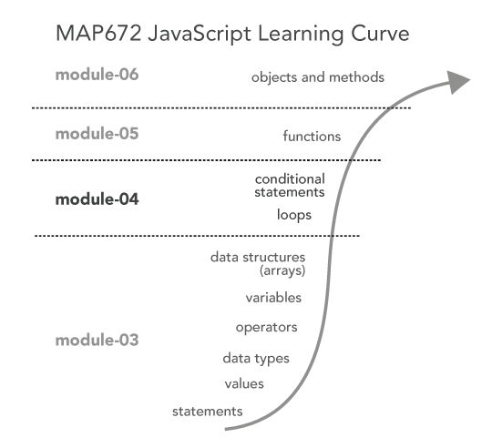

# Lesson 04: JavaScript Control Structures

In module 03, when we ran our script within our web browser (such as by hitting page refresh), our JavaScript executed from the top of the script to the bottom. This is to say, the "flow of program execution" moved in one direction, from top to bottom. However, often we want to interrupt this flow of execution in various ways. This is where the idea of **control structures** come into play. Within this lesson, we'll learn how we control of flow of our JavaScript program.

  
Figure 01. JavaScript learning curve.

## TOC

- [JavaScript properties](#javascript-properties)
- [Control structures and looping in JS programming](#control-structures-and-looping-in-js-programming)
- [Control structures: the if and else statements](#control-structures-the-if-and-else-statements)
- [Additional Resources](#additional-resources)
- [Glossary](#glossary)

Open the *map672-s16/module-04/* directory in Brackets. Then open the *lesson-04-data/index.html* Lesson 03 Starter template in the Working Files of Brackets. Follow along with the lesson instructions, writing JavaScript code (toward the bottom of the document between the `<script></script>` tags), from the examples. You can comment out this code as you proceed through the lesson. However,  save this file as you work and Sync it back up with your personal repository when completed. **This will constitute 20% of your lab 03 assignment grade,** in addition to the [*lab-04.md*](lab-03/lab-04.md) assignment.

## JavaScript properties

Before we get into looping and control mechanisms, we need to briefly introduce a new key term: that of JavaScript **properties**. For now we can think of properties as similar to a variable in that they are used to store and retrieve a value or bit of information. The difference is that properties are  attached to other objects, such as an array. 

Properties are attached to arrays (and other objects) using a period, a convention known as **dot notation** or "dot syntax." We're only going to talk about one array property now, that of `length`, or the number of values held by an array. If we want to know the number of values in an Array, we can access that value with <code>*arrayName.length*</code>.

```javascript
var cities = ["Frankfort", "Louisville", "Lexington"];
console.log(cities.length);  // output will be 3
var years = [2011, 2012, 2013, 2014, 2015, 2016];
var yearsNum = years.length;
console.log(yearsNum); // output will be 6
```

You should see `3` and `6` output to the console since the cities array has three values and the years array has six.

We'll be using the *length* property in the looping mechanisms below.

## Control structures and looping in JS programming

Looping is a common way of controlling the flow of execution of a script. The `for` loop is the most common (and often the computationally fastest) of the looping mechanisms. The syntax of the for loop may look confusing at first, but it is very common. You'll be using it frequently, so write it into your script and study it carefully, as well as the output in the JavaScript Console:

```javascript
console.log("before the for loop");
for (var i = 0; i < 5; i++) {
  console.log(i); // outputs numbers from 0 to 4
}
console.log("after the for loop");
```

The `for` statement (a reserved keyword in JavaScript) is followed by an opening and closing parentheses. Within the parentheses are three expressions, separated by semicolons: 

1. First, we declare a variable named `i` (which generally stands for *integer*) and assign it a value of zero (`var i = 0;`). This expression initializes, or begins, a counter variable (a variable that counts). 
2. Second, following the first semicolon is an expression `i < 5;` which checks to see if the value of i is less than 5 (in this case). If that expression is true (i is less than 5), then: 
3. Third, the final expression (`i++`) is executed. If not, the looping mechanism stops. The `i++` expression uses an operator we haven't seen yet, the double plus sign `++`. This operator is equivalent to `i = i + 1` and is simply a quick way of adding 1 to a current numeric value. The third, final expression within the parentheses therefore acts to increment the counter variable.

Thus, the loop will continue to execute the statements contained within the curly brackets `{` and `}` (what's known as a **block statement**) until the expression contained within the parentheses resolves to false. In this case, this happens when `i` is no longer less than 5. The program then will continue to the next line of code below the for loop (`console.log("after the for loop");`).

Note that the use of `i` here is arbitrary. We could just as well use another variable name, such as `number`:

```javascript
for (var number = 0; number < 5; number = number + 1) {
  console.log(number); // outputs numbers from 0 to 4
}
```

Note here that instead of using the shorthand `i++` we've written the equivalent in a longer form (`number = number + 1`).

We often use for loops in JavaScript by looping through values of an array. To do this, we'll use the length of the array (how many values are in an array) within the second expression to determine how long the loop should continue. Study this code and it's output carefully, particularly what's happening inside the `for` loop's block statements. Think about the flow of execution as the loop progresses through incrementing the value of i, and how the variable i is used to access the index values of the array using the bracket notation. This is a classic for loop in computer science, and one you'll get to know well. **Be sure to conceptually understand this one!**

```javascript
var cities = ["Frankfort", "Louisville", "Lexington"];
for (var i = 0; i < cities.length; i++) {
    console.log(i); // output the current value of i
    console.log(cities[i]); // use i to access an index of the Array
}
```

Alternatively, we could use a for loop to construct an Array of integers from 1 to 10.

```javascript
var newArray = []; // define an empty Array
for(var i = 0; i < 10; i++) {
    newArray[i] = i + 1;
}
console.log(newArray); // output will be [1, 2, 3, 4, 5, 6, 7, 8, 9, 10];
```

Finally, we can get even tricker and have a nested looping structure (a loop within a loop)!

```javascript
for (var i = 0; i < 5; i++) {
  console.log('outer loop: ' + i);
  for (var j = 0; j < 5; j++) {
    console.log('inner loop: '+ j);
  }
}
```

Study this structure carefully, and in your mind imagine the "flow of execution" as the program loops once through the outer for loop, but then five times through the inner loop, then for a second time through the outer loop, then again five times through the inner loop, and so on.

A classic type of test question in a Computer Science department may ask you to, with pencil and paper, determine the value of sum that's logged to the Console in this example:

```javascript
var sum = 0;
for (var i = 0; i < 5; i++) {
  for (var j = 0; j < 5; j++) {
    sum += j;
  }
  sum += i;
}
console.log(sum);  // output will be 60.
```

We're not going to do things like that because we're more interested in having fun with our examples to make maps. But still this is the kind of logical thinking you should begin to practice as you write code.

Read more about the [for statement](https://developer.mozilla.org/en-US/docs/Web/JavaScript/Reference/Statements/for) and the [JavaScript For Loop](http://www.w3schools.com/js/js_loop_for.asp).

An alternative to the classic for loop in JavaScript is the `while` loop. This loop works in a similar way as the `for` loop, though the syntax is different. There is only one expression within the parentheses, and as long as it resolves to `true`, the loop will continue. Note that we declare and assign the variable of `i` externally to the looping structure itself (the `var i = 0;` line), while `i` is incremented within the block statement itself (the `i++` statement): 

```javascript
var cities = ["Frankfort", "Louisville", "Lexington"];
var i = 0;
while (i < cities.length){  
    console.log(i);
    console.log(cities[i]);
    i++		
}
```

This while loop in this example operates exactly like for loop above. Generally speaking, you'll use a for loop when you know how many times you want to loop, such as for the number of elements in a dataset. You'll use a while loop when the value used in the expression is unknown (which, may not make sense given these simple examples, but will become clearer in more complex programs).

Note that JavaScript is a very flexible language, and you may see examples of loops that do not use the curly braces. It is, however, good practice to use them and is recommended within this course. 

Read more about the [while statement](https://developer.mozilla.org/en-US/docs/Web/JavaScript/Reference/Statements/while) and the [JavaScript While Loop](http://www.w3schools.com/js/js_loop_while.asp).

## Control structures: the if and else statements

The for and while statements introduced above allow us to disrupt the normal flow of a programs execution. Rather than just exciting statements from the top of the script to the bottom, the program will loop before continuing. **If and else statements** allow for even further control over the flow of the program and play very nicely with looping.

The syntax is similar to that of the `for` and `while` loops: 

1. First the statement `if`, 
2. followed by an opening and closing parentheses that contain an expression that evaluates to either true or false, 
3. followed by block statements contained within curly braces. 

If the expression evaluates to true, the block statements are executed.

Write and test the following code:

```javascript
var temp = 32;
if(temp === 32) {
   console.log('the temperature is freezing');
}
```

Because the number 32 is equivalent with the value of `temp`, the expression evaluates to true and the *console.log* statement within the braces is executed. Again, pay attention to how a single equal sign is used `=` to assign a value to a variable and a triple equal sign is used `===` to test if two things are equal.  

Try changing the value of `temp` to 33 and running the code again.

```javascript
var temp = 33;
if(temp === 32) {
   console.log('the temperature is freezing');
}
```

There is no output! BUT the program has run successfully because the conditional expression evaluated to false, and therefore the statements within the curly braces did not execute. However, it'd be nice if we knew this. Let's include another statement, the *else* statement. Else statements just follow an *if* statement.

```javascript
var temp = 33;
if(temp === 32) {
   console.log('the temperature is freezing');
} else {
    console.log('the temperature is NOT 32, but still may be freezing');
}
```
In this case, the conditional statement evaluates to false and the code within the `else` block statement runs, rather than within the `if` block statement. 

Often we want to test more than one condition before executing the  `else` block statement. We can add subsequent *else if* statements after the first `if` statement and before a final *else* statement. The comments within this example help explain how the if, else if, and else statements  work.

```javascript
var temp = 33;
if(temp <= 32) {
    console.log('the temperature is freezing');
else if(temp > 32) {
    console.log('the temperature is above freezing');
} else {
    console.log('the value of temp must not be a number');
}
```

`If` and `else` statements are useful by themselves. But they're more powerful when using them inside looping mechanisms. Let's consider the following code. Let's start with a simple example.

```javascript
for(var i = 0; i <= 10; i++) {
    if(i === 5) {
        break;
    }
    console.log(i); // out will be 1 2 3 4
}
```

Often when we loop, we're looking for a conditional statement to evaluate to true, but we no longer need the loop to continue once that condition has been met. In this case we'll use a special statement known as a *break* statement to "break" out of the loop, thereby returning the flow of execution of the script to its normal course. Within this example, the JavaScript will loop through each number, staring at zero, until the incremented value of `i` is equals to five. At that point, the condition within that `for` loop is true, and the `break` statement within the `for` loops block statement ends the loop.

**Question:** How is the output different if the `console.log(i);` statement executes before the `if` statement? 

Next, let's say we have an array of city names, and we have the name of a particular city stored as a variable. We want a piece of code to test whether that city name is contained with the array. We can use a loop and an *if* statement to perform this test:

```javascript
var cities = ["Frankfort", "Louisville", "Lexington"];
var testCity = "Louisville";
for (var i = 0; i <= cities.length; i++) {
    if(cities[i] == testCity) {
        console.log(testCity + " is found in the city Array!");
    }
}
```

Furthermore, we could use the loop to tell us where in the array that city is found. Write this JavaScript code and examine the output in your Console.

```javascript
var cities = ["Frankfort", "Louisville", "Lexington"];
var testCity = "Louisville";
for (var i = 0; i <= cities.length; i++) {
    if(cities[i] == testCity) {
        console.log(testCity + " is found in the city Array at index "+ i+ "!");
    }
}
```

Following from the previous simple examples, we can include an `else` statement to let us know that the value hasn't been found within the array:

```javascript
var cities = ["Frankfort", "Louisville", "Lexington"];
var testCity = "Bowling Green";
for (var i = 0; i <= cities.length; i++) {
    if(cities[i] == testCity) {
        console.log(testCity + " is found in the city Array at index "+ i+ "!");
    } else {
        console.log(testCity + " was not found within the Array at index "+ i+ "!");
    }
}
```

Again, we can use a `break` statement to end the looping when a certain condition is met. The following example will log to the Console the values within the array until it finds one that matches the number 2012:

```javascript
var years = [2008, 2009, 2010, 2011, 2012, 2013, 2014, 2015];
for(var i = 0; i <= years.length; i++) {
  if(years[i] == 2012) {
    break;
  } else {
    console.log(years[i]);
  }
}
```

Read more about [if/else statements](https://developer.mozilla.org/en-US/docs/Web/JavaScript/Reference/Statements/if...else) and [JavaScript If ... Else Statements](http://www.w3schools.com/js/js_if_else.asp).

## Additional Resources

* Read the sections on "Control Flow" in Chapter 2 of Haverbeke (2014) [Program Structure](http://eloquentjavascript.net/02_program_structure.html)
* Read more about [for loops](https://developer.mozilla.org/en-US/docs/Web/JavaScript/Reference/Statements/for), [while loops](https://developer.mozilla.org/en-US/docs/Web/JavaScript/Reference/Statements/while), and [if/else statements](https://developer.mozilla.org/en-US/docs/Web/JavaScript/Reference/Statements/if...else)

## Glossary

* **property**: when used with an Array, stores information about that Array, such as its length
* **dot notation or dot syntax**: the use of a period to concatenate a property or method to an object 
* **control structure**: the use of looping mechanisms and conditional statements (e.g., if/else) to control the flow of a programs execution
* **for loop**: a looping structure that iterates a counter variable until a given expression is no longer resolve as true
* **while loop**: a looping structure that continues until a given expression is evaluated as false
* **if statement**: executes a statement (or block statement) if a specificed condition is true
* **else statement**: executes a statement (or block statement) if a previous if condition does not evaluate to true
* **break statement**: a statement that breaks the flow of a program's execution from the  looping structure and returns to the normal flow

