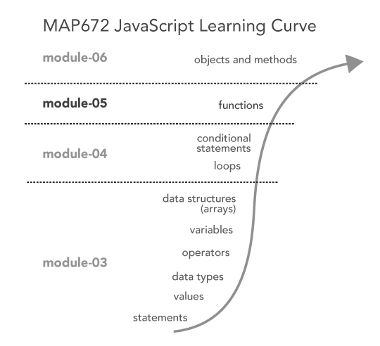

# Lesson 05: JavaScript Functions

Often when we're programming, there are certain chucks of code (groups of JavaScript statements) that are all related and work together to accomplish specific functionality within the overall program. And often, we want to execute these at specific times, than once, or even repeatedly. Within this lesson, we'll learn how we make our programs more efficient through the use of **functions**. We'll first learn how we declare and define functions. Then we'll make functions more powerful by passing information to them and receiving information in return. 

  
**Figure 01.** JavaScript learning curve.

We're quickly ascending the JavaScript learning curve, and functions are a powerful tool you'll soon enjoy using. To follow along with this lesson, open the *index.html* file located in the *lesson-05-data/* directory, type the code within the examples into the file, save, and test in your browser. Save these examples (and comment them out if you wish) as  you follow along. Submission of this file counts for 10% of this week's lab grade. Most importantly, have fun! 
    
## TOC

- [What are functions?](#what-are-functions)
- [Writing functions declarations](#writing-functions-declarations)
- [Writing function expressions](#writing-function-expressions)
- [Passing arguments and using function parameters](#passing-arguments-and-using-function-parameters)
- [Return values](#return-values)
- [Function scope](#function-scope)
- [Resources and Additional Reading](#resources-and-additional-reading)
- [Glossary](#glossary)

## What are functions?

So far, we’ve been writing JavaScript code as one big unit of statements. The program runs top to bottom (with the exception of looping structures), and as things get more complicated, the code begins to look a bit messy. This is where functions come in. As it is written in *Eloquent JavaScript* [notes](http://eloquentjavascript.net/03_functions.html):

>"Functions are the bread and butter of JavaScript programming. The concept of wrapping a piece of program in a value has many uses. It is a tool to structure larger programs, to reduce repetition, to associate names with subprograms, and to isolate these subprograms from each other.  The most obvious application of functions is defining new vocabulary. Creating new words in regular, human-language prose is usually bad style. But in programming, it is indispensable."

Functions are therefore a fundamental building block of larger programs and act to bundle sequences of JavaScript statements together so they may run at specific times. Thus, rather than have 30 lines of code mucking around your program flow and confusing you, you bundle these lines into a function, store some place more out of the way and use one line to call it.

There are two ways of writing functions in JavaScript: either as **function declarations** or **function expressions**

## Writing functions declarations

First let’s cover the syntax for writing **function declarations**. We begin declaring a function with the keyword `function`, followed by a name of the function. This is very similar to **variable delcarations** using the `var` keyword. We also use camelCase naming convention for functions, similar to naming variables. 

Here’s an example of a very basic function declaration:

```javascript
function helloMap() {
    console.log("Hello Map");
}
```
Though you can begin a function with a letter or special character (such as an underscore or dollar sign), you should also avoid using one of JS's reserved keywords as a function name:

>break case catch class const continue debugger default delete do else enum export extends false finally for function if implements import in instanceof interface let new null package private protected public return static super switch this throw true try typeof var void while with yield

Also required to write a function are two parentheses that immediately follow the function name (more about how to use this in a bit). Following the parentheses is a block statement written with an opening and closing curly braces. This is similar to those used by the `for`, `while`, `if` and `else` statements. We refer to the statements within a function's block statement as  the function’s **body**). 

**Important:** When you write this function into your script, save the file, and refresh the browser, you will not see the "Hello Map" logged to the console. Why not? This `console.log` statement, contained within the function’s block statement, has not yet been executed. We've simply written (or declared) a function. But it has not yet been executed, and neither have the statements within its body.

To get the statements within a function’s block statement to run, we need to **"call"** or **"invoke"** the function. We call a function with a simple statement: the name of the function itself, including the two required parentheses:

```javascript
function helloMap() {
    console.log("Hello Map");
}

helloMap(); // this statement calls or invokes the helloMap() function!
```

Now you should see "Hello Map" logged to the Console in your browser.

We can think of the function as a piece of code that is waiting, ready to be executed for whenever we wish to call it. We can call it multiple times, for example:

```javascript
function helloMap() {
    console.log("Hello Map");
}

helloMap();  // Console output will be Hello Map
helloMap();  // Console output will be Hello Map
helloMap();  // Console output will be Hello Map
```

What if we wanted to call a function 100s or even 1000s of times? We wouldn't want to write that function call statement that many times. Instead, we'd want to build a looping structure to call the function repeatedly within it's block statement.

Also, note that we can call the function before the function has been declared. This is what's known as function "hoisting" and is different than writing function expressions (below).

```javascript
helloMap(); // this statement calls or invokes the helloMap() function!

function helloMap() {
    console.log("Hello Map");
}
```

## Writing function expressions

While we'll primarily be writing function declarations as we move forward. another way to write functions in JavaScript is through use of a **function expression**. That is, rather than writing a stand-alone block of code as a function declaration, we can assign a function to a variable. Here is an equivocal function as above, written as a function expression:

```javascript
    var helloMap = function() {
        console.log("Hello Map");
    };
    
    helloMap();
```

The important thing to remember when writing function expressions is that they must be written before they are invoked. The function is not "hoisted" as the function declaration is. Therefore, this will break:

```javascript
    helloMap();  // will throw an error
    
    var helloMap = function() {
        console.log("Hello Map");
    };
```

While not critical to fully understand yet, what's a practical example of why we'd use a function expression rather than a declaration? When we wish to nest a function within another one (which is quite allowable in JavaScript!), we need to use the expression approach to avoid issues in some web browsers that run JavaScript within a "strict" mode. 

So if you find yourself needing to have a function within the body of another function, this is the appropriate way to use a function within another. Write the follow code and think carefully about how the code will execute. Which statement logging `message` will log to the Console first, the "I'm outside" or the "I'm inside"?

```javascript
function outerFunction(message) {
    console.log(message);
    var innerFunction = function(message) {
        console.log(message);
    };
    innerFunction("I’m inside!");
}
outerFunction("i'm outside!");
```

The flow of execution through this example is fairly challenging to comprehend at first, so no need to worry if it doesn't click. Remember, we're learning a language, and sometimes it takes some more practice to get it! And for the time being, we'll primarily be writing and using function declarations and not function expressions.

##Passing arguments and using function parameters

So far we’ve declared and called the most basic type of function. Essentially, the function receives no information when it’s called. It just does something, and does it once. While this is helpful, functions can be much more useful when they receive information from the "caller," or the statement that calls or invokes the function. We can send information into the function when we call it. So rather than just doing exactly the same thing, the function uses a piece of information within it's function body. 

We refer to this as **passing arguments** to the function. An argument is an expression that is passed along to the function when it is called. Remember those two parentheses we need to include when declaring and calling a function? A caller sends arguments by including them within those parentheses. The function then receives these arguments (technically known as *parameters* as they enter the function) within its parentheses. Think of arguments and parameters a kind of variable that refer to values or expressions used within functions. We can name these whatever we want (as long as it is not a reserved keyword!), and they too follow the camelCase naming convention. Consider this example (and then perhaps re-read this paragraph):

```javascript
function saySomething(message) {  // function signature accepts information as a "parameter"
    console.log(message);
}

saySomething("Hello Map"); // function is called, passing an "argument" with it
```

This function is far more flexible and powerful than the previous one we created above. We can now pass any message we want to it:

```javascript
function saySomething(message) {
    console.log(message);
}

saySomething("Hello Map");
saySomething("Please enter the address you'd like to search for.");
```

Note that in that example, we're passing a String value, `"Hello Map"`, as the argument, and the parameter `message` then refers to the value within the function's body. Often we use variables as arguments. This example is the same as above, but note how the variable name used to call the function is not the same as the world used for the parameter.

```javascript
function saySomething(message) {
    console.log(message);
}

var firstMessage = "Hello Map";
saySomething(firstMessage);

var secondMessage = "Please enter the address you'd like to search for."
saySomething(secondMessage);
```

**This is important and often confusing:** Even though `firstMessage` (used within the function call) and `message` (used within the function definition) are different, then both refer to the same value.

But they need not be different words, and often we'll use the same word to keep things clear. So again, this example is functionally doing the same thing as above.

```javascript
function saySomething(message) {
    console.log(message);
}

var message = "Hello Map";
saySomething(message);

message = "Please enter the address you'd like to search for."
saySomething(message);
```

We can also pass multiple arguments to a function. We simply include them within the parentheses and separate them with commas. Let’s say we want to write a function that calculates the area of a rectangle. This is actually a quasi-useful function for mapping as we often want to know the physical area of polygons. Of course, the world is not made of rectangular land areas, with the exceptions of various parts of the agricultural Midwest (we’re looking at you Iowa!).  Still, you can begin to see how one might construct mapping-related functions. The function for calculating a square is:

```javascript
function calcAreaRect(width,height){
    var area = width * height;
    console.log(area);
}
```

We can then send two Number values to the function. Note how they are incorporated into a JavaScript expression (`width * height`) and assigned to a variable within the function’s block statement:

```javascript
function calcAreaRect(width,height){
    var area = width * height;
    console.log(area);
}

calcAreaRect(40,30);
```

Again, we often pass arguments to a function in the form of a variable:

```javascript
function calcAreaRect(width,height){
    var area = width * height;
    console.log(area);
}

var width = 40;
var height = 30;
calcAreaRect(width,height);
```

We can pass as many arguments to a function as we’d like, as long as the function’s declaration (sometimes referred to as a function’s "signature") specifies a parameter for each argument passed when the function is invoked. The order of the arguments passed corresponds with which parameter they are assigned to when they "reach" the function. In the previous example, the first value sent as an argument was assigned to the `width` parameter, the second to the `height`.

This is confusing and important, so let's again demonstrate that the names we use for arguments and parameters are not persistent (i.e., do not stay the same) between calling a function and passing along arguments and when they reach the function (and magically become parameters). 

The arguments are passed to the function, but the names of the arguments (in the call) and parameters (in the function that receives them) don’t have to be the same.  Again, **it's the order in which they are passed** that really matters. So, we could have written:

```javascript
function calcAreaRect(width,height){
    var area = width * height;
    console.log(area);
}

var peanutButter = 40;
var jelly = 30
calcAreaRect(peanutButter,jelly);
```

The value of the variable `peanutButter` (40) is passed to the `calcAreaRect` function and assigned to the parameter `width`, which is then accessible as `width` within the function’s block statement. 

However, to keep things simpler and clearer, we often use the same name for the arguments as the parameters to which they correspond. Just remember that they don’t need to do so (yes, this section has repeated this a couple of times, but it seems to be a sticky point for newbie programmers). 

##Return values

So far we’ve created more flexible and powerful functions by writing them to accept arguments and do something with these arguments within their body. After the function executes the statements within its body, the story ends there. 

A function can become more useful, or "fruitful," by sending (or "returning") information back to its caller (the statement that invoked the function).  In computer programming, this is called "returning a value" as it provides useful information back to the statement that called it.

To do so, we simply use the `return` statement, followed by the value we wish to return.

```javascript
function calcAreaRect(width,height){
    var area = width * height;
    return area; 
}

var calculatedArea = calcAreaRect(40,30);  // <-- the return value is assigned to calculated Area
console.log(calculatedArea);
```

Here, we are declaring a new variable `calculatedArea` and assigning it the return value from the `calcAreaRect` function. The function returns the value, it is assigned to the new variable, and then it is logged to the Console. 

One thing to keep in mind with return statements is that statements within a function’s body that are written below a `return` statement will not be executed. For example:

```javascript
function sayThings() {
    
    console.log("thing 1"); // will output to console
    console.log("thing 2"); // will output to console
    return;                  // returns an `undefined` value
    console.log("thing 3"); // will NOT output to console
}

sayThings(); // calls the function
```

Also note that the return statement can only return a single element. If you wish to return multiple values, you can, for example, put them in an Array and return that Array (itself being a single element):

```javascript
function getMultiValues() {
    var value1 = 5;
    var value2 = "iguana";
    return [value1, value2];
}

var values = getMultiValues();
console.log(values[0]); // output is 5
console.log(values[1]); // output is "iguana"
```

##Function scope

So far in this lesson we’ve seen how functions are used to bundle chunks of code for use and re-use. Functions also provide an additional purpose within programming: that of establishing a **local scope**. That is, the variables created within a function’s body exist (and are accessible) *only from within that body*, or that particular function’s scope. Within computer science we refer to this packaging of related bits of code **encapsulation**. 

In addition to the local scope, defined within the body of a function, there is also the wider *global scope* of the HTML document itself. 

Consider this example of code that would result in an error:

```javascript
function sayHello (){
    var greeting = "Hi, I’m a web mapper.";
    console.log(greeting);
}

sayHello(); // function call
console.log(greeting); // throws an error
```

While the variable `greeting` exists and is accessible within the function `sayHello()`’s body, that variable is unknown outside of that scope, in the global scope.  Therefore the second call to log `greeting` to the Console throws an error because within the global scope that variable has not be defined and is not accessible.  

This is useful, because we can define and use variables within a function scope and not have to worry about them being computationally confused with variables outside that scope. For example:

```javascript
function sayHello(){
    var greeting = "Hi, I’m a web mapper."; // variable defined within the function scope
    console.log(greeting); // output is "Hi, I’m a web mapper"
}

sayHello();  // output is "Hi, I’m a web mapper"

var greeting = "Howdy, I'm a cartographer"; // variable defined within the global scope
console.log(greeting); // output is "Howdy, I'm a cartographer"
```

In this case, the `greeting` variable was not re-declared and assigned a new value. According to the program, these two variables are as distinct as `peanutButter` and `jelly` because they exist in different scopes (sometimes referred to as namespaces, though the **namespace** generally refers to the highest level scope).

However, that being said, objects within a global scope *are accessible* within a local scope contained within it.

Consider how this example is different than the preceding one?

```javascript
function sayHello(){
       console.log(greeting); 
}

var greeting = "Howdy, I'm a cartographer"; // variable defined within the global scope

sayHello();  // output is "Howdy, I'm a cartographer"
```

In this case, `greeting` is defined in the global scope

Functions, in particular the passing of arguments, return values, and function scope, are conceptually challenge to grasp at first. With more practice reading and writing functions, we’ll get the hang of them.

## Resources and Additional Reading

* Chapter 3 of *Eloquent JavaScript*: [Functions](http://eloquentjavascript.net/03_functions.html)
* The w3schools [JavaScript Functions](http://www.w3schools.com/js/js_functions.asp)
* The Mozilla Developer Network's [Defining Functions](https://developer.mozilla.org/en-US/docs/Web/JavaScript/Guide/Functions)

## Glossary
* ****:
* **function**: a set of reusable, self-contained statements of code that perform specific tasks (such as calculating and returning a value)
* **function body**: the statements contained within the curly braces of a function, also designating the functions "local scope"
* **calling or invoking a function**: the statement that "triggers" the function, passing optional arguments along with the call
* **argument**: the value passed to a function when that function is called
* **parameter**: the variable found within a function definition (and used within the function’s body) to which an argument is assigned
* **return statement**: the statement within a function’s local scope that terminates the sequence of statements within a function and returns 
* **function or local scope**: corresponds to the statements contained within a function’s body. variables created within the local scope are not accessible outside of this scope (i.e., in the global scope) 
* **encapsulation**: building together JavaScript statements for reuse and restricting access to these statements and values from outside that scope

