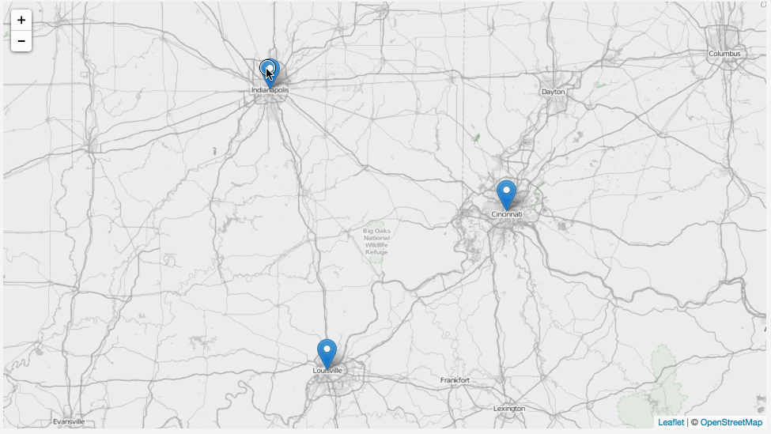
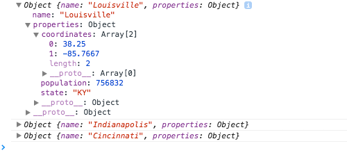

# Lab 06: JavaScript Objects

The goal of this lab is to build a map with markers placed on three cities within three different geographical units, whether they be counties, states, countries, etc. The popup of each marker will display the text in a unique color dependent upon the unit in which the city marker is located. Your finished map should look and behave like this:



Begin with the starter template located in the *lab-03-data*, save your changes to this *index.html* file, and **commit changes to your local GitHub repository** as you work. Begin your coding beneath line 82 containing the comment `begin writing/editing Lab 06 code here`. 

So far in MAP672, the modules have used the array data type to structure and store information about various cities for web mapping using a Leaflet map. This lab will improve upon these maps by using JavaScript objects to store our information, integrating these objects with the looping and conditional logic practiced within earlier modules.

The completed script will store individual city information within JavaScript objects. An array will hold the three city objects. The script will then loop through this array, creating a popup holding the city's information and adding a marker to the map in the correct location. The popup will use an additional function to determine a unique color for that text and build the HTML content inserted within the popup.

**Pseudocode** is a description of a programming script or algorithm, written as natural language rather than as code. It helps us think through a program. The pseudocode for this script is as follows:

// define the cities data within an object and store all within an array  
// loop through each city and  
    // create a variable to access each city's properties  
    // create a variable to store the popup content for each city  
    // retrieve this content with a call to a function that will  
        // assign a CSS class name to a variable used to color the text  
        // return a string concatenating the name and population of each city within HTML
    // assign the return value of the function to the popup variable  
    // create a Leaflet marker with the city's coordinates and bind the popup  

Follow these steps to complete the lab:

1. First create three JavaScript objects that each represent a different city. The starter template contains an example of such a JavaScript object for Louisville, KY. You don't need to use Louisville and can pick any other three cities you wish (you may have to adjust the center zoom coordinates and zoom level so your cities are visible within the map view upon page load). 

    Each city object will be composed of two properties: 

    * The the name of the first property will be `name`, and its associated value will be a string value of the name of the city (e.g., `name: "Louisville"`). 
    *  The name of the second property within each city object will be `properties`. Its value will be another object which will hold three additional properties: 
 
         * `coordinates` (the value of which will be an array),          
         * `population` (the value of which will be  a number value), and 
         * `state` (the value of which will be a string value). 
 
     For example, an object representing the city of Louisville will look like this:
      
    ```javascript
        {
            name: "Louisville,",
            properties: {
                coordinates: [38.25, -85.7667],
                population: 756832,
                state: "KY"
            }
        }
    ```
    
    Create an array named `cities` to contain these three city objects. Load the map in your browser and verify you have no errors before proceeding. (**1pt**)

2. Next, construct a `for` loop that will loop through the three object elements within your `cities` array. (**1pt**)

    Within the loop, write a  `console.log()` statement. First, try logging to the Console each element within the `cities` array, like so:

    ```javascript
     // for loop to loop through the cities
             console.log(cities[i]);  // log statement within the body of the for loop
    // end of the for loop
    ```

     After refreshing your browser's web page, within the Console you should see three lines of output that look something like `Object {name: "Louisville", properties: Object}` (see the image below). You've logged the contents of each of your `cities` array objects to the Console. By clicking on the grey arrows to the left you can "drill down" into the nested structure of these objects. You can see the various key/values (e.g., `name:"Louisville", properties: Object`) that comprise these objects (there's also a desaturated `_proto_` property, but we need not concern ourselves with that now).

    

    Modify your code to access just the `properties` of each city object and log that result to the Console, using either bracket or dot notation, (i.e., `console.log(cities[i].properties);`). 
    Next, try to specifically output the value of the population or the longitude of the cities contained within the `properties`'s object. Examine the output of this second *console.log* statement.

    * Note feel free to comment out the previous *console.log()* statements so the output doesn't get cluttered and confusing while you continue to work and debug. 

3. Once you have figured out how to access these properties, at the top of your `for` loop create a new variable named `props`  and assign it `cities[i].properties` (see the example below).

    ```javascript
      // for loop to loop through the cities
           var props = cities[i].properties;     
      // end of the for loop
    }
    ```

    This will act as a shorthand for accessing these properties further on in the script, so you don't need to write `cities[i].properties` each time but can simply write `props`. A  quick test is to use the *console.log* statement to generate the same output as above (i.e., `console.log(props)`). 

4. After creating the `props` variable within the loop, create a variable for the popup content of our map markers, and assign a simple string for now (e.g., `"I am a temporary string value"`). Then write a new statement using the mysterious `L.marker( ...` code we've been using so far within the labs. After reading Module 6, you may now recognize the `.marker()` as a method (a Leaflet method)! Again, a method is a function that's attached to an object (the `L` is a Leaflet object, but we'll get to that in Lesson 07).

    We're going to pass one argument with this method call: the value of the `coordinates` property currently accessible with newly created our `props` variable. Your `for` loop should now contain the following code (not including any `console.log()` statements you may have):

    ```javascript
    var props = cities[i].properties;
    
    var popup = "I am a temporary string value";
    
    L.marker(props.coordinates).addTo(map)
            .bindPopup(popup);   
    ```
 
    Save your document and test the map in the browser (verifying there are no errors). Your map should now contain the three markers, each with a popup that says something useless like "I am a temporary string value." 

5. Instead of assigning a string to the `popup` variable, we want to instead construct the popup content dynamically within a separate function that will (a.) use conditional logic to determine which color should be applied to the text based on its geographical unit (i.e., which state), and (b.) insert the name and population of each city within the string returned to the `popup` variable within the `for` loop. 

    Name this function `buildPopup`, call it within the *for* loop, and pass it three arguments (the values for the name of the city, the population of the city and the geographical unit). Right now if you load the file you will get an error since the function doesn't exist yet. Remember that if we call a function, there must exist a function by that name. (**2pt**)

6. The next step is to declare the *buildPopup* function (make sure it is outside of the *for* loop). It will need to achieve the following: (a) accept the three argument values sent by the function call within the parentheses as parameters (name them `name`, `pop`, and `state`); (b) use conditional if/else statements to determine which state a particular city is located; and (c) create and assign a unique string value to a variable named `colorClass` based on which state each of the cities are located. You'll end up with three different colors since your cities are in different states/countries. The value of `colorClass` must correspond with CSS class definitions contained in the CSS style rules at the top of the document (an example is written within lines 47 to 49 of the starter template file). For example, if we've created a CSS rule with a selector name of `kentucky-blue`, we'll assign a string value with that same name to our `colorClass` variable here (CSS selectors typically use a hyphen instead of camelCase syntax).

    ```javascript
        if(state == "KY") {
            var colorClass = "kentucky-blue";
        }
    ```

    You should create new CSS style rules and use different colors for each of your cities (you can determine the hexidecimal values for various colors from such a website as [http://www.color-hex.com/](http://www.color-hex.com/)). (**2pt**)

7. After your conditional statements assign a value to `colorClass`, the *buildPopup* function should return the following string. Remember to include the return statement and copy this code exactly for the return value:

    ```javascript
        "<div class='"+colorClass+"'><b>"+name+"</b><br>"+
        "<b>Population</b>: "+pop.toLocaleString()+"<div>";
    ```
    You'll see here that we're wrapping the content of our popup with HTML markup. The `<div>` element is given a `class` attribute the value of the `colorClass` variable (which will be different each time this function is called). (**1pt**)

8. Once you have the map working, each popup should be uniquely colored based upon the value contained with the `state` property of each city's `properties`. To polish, change the `h1` and `h2` tags to update your web document with an appropriate title and subtitle, and edit the text at the bottom of the page (e.g., author and meta information). (**1pt**)

9. Sync your final solutions with your remote repository and provide a link within Canvas by the due date: **Friday, February 26th, 11:59pm**.