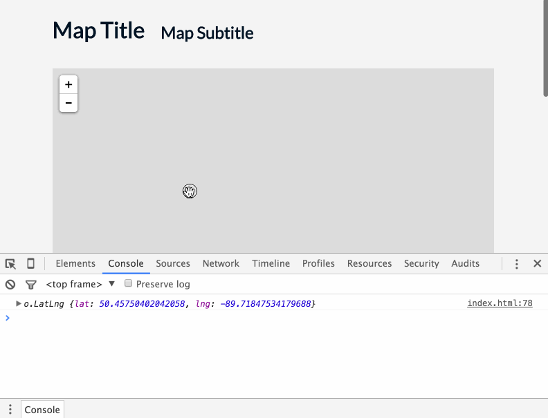

# Lab 07: Leaflet Map Basics

The goal of this lab is to create a Leaflet map with a unique basemap of your choosing. When the user clicks once on the map, the map is re-centered on that click point and zoomed to a new zoom level your choosing. Furthermore, the JavaScript calculates two pieces of information:
1. how far (the distance in meters) that point click is from the Red Iguana restaurant (located in Salt Lake City at latitude 40.7718 and longitude -111.9124), and
2. how far the Red Iguana restaurant is from the Southwest corner of the re-centered map view.

Save your changes to your *index.html* file and **commit changes to your local GitHub repository** as you work.

Open the starter *index.html* file in your text editor and examine the provided JavaScript code:

```javascript
var map = L.map('map', {
    center: [40,-94],
    zoom: 4
});

var redIguana = L.latLng(40.7718,-111.9124);

map.on('click', function(e){
    console.log(e.latlng);   
});
```

You'll see that a Leaflet map object has already been created, centered on latitude 40 and longitude -94 (in Salt Lake City, UT), with a zoom level of 4. Also, a Leaflet `LatLng` object has also been created using the coordinates of the Red Iguana restaurant and assigned to the variable `redIguana`. Additionally, the Leaflet map `.on()` event method is being called and listening for a click event. The callback function then logs the `LatLng` object of that click event to the Console. Note that you will not see a tiled basemap yet. When you run this script in your browser, you'll see the click events logged to the Console.

  
**Figure 01.** Logging click locations.

1. First, modify the Leaflet map options to constrain the map's minimum zoom level to 4 and maximum zoom level to 12. (**1pt**)

2. Look through the Leaflet-providers preview and choose a basemap of your liking ([http://leaflet-extras.github.io/leaflet-providers/preview/](http://leaflet-extras.github.io/leaflet-providers/preview/). Add this basemap tileset to the Leaflet map. Save your file and refresh the browser to verify that the map is now loading a tiled basemap. (**1pt**)

3. Within the `.on()` method's callback function, replace the `console.log()` statement with the following:

    a. a statement that stores the click event's LatLng object (i.e., its location) as a variable (**1pt**)
    
    b. a statement that uses this variable to recenter the map on the location of the user's click event at the zoom of six, using a Leaflet map method (**1pt**)
    
    c. a statement that uses this variable to calculate the distance between it and the location of the Red Iguana restaurant, storing the result as a variable (**1pt**)
    
    d. a statement that logs the previously created value (i.e., the distance between the click event and the Red Iguana restaurant) to the Console. (**1pt**)
    
    e. a statement (or statements) that determines the LatLng object of the Southwest corner of the map view's current bounding box and stores this value as a variable (hint: you'll need to read the Leaflet API documentation to figure this out)  (**1pt**)
    
    f. a statement that calculates the distance between the Red Iguana and the Southwest corner of the bounding box (which has been changed with the center and zoom upon the click)  (**1pt**)
    
    g. finally, a statement that logs the result of the previous calculation (the distance between the Red Iguana restaurant and the Southwest corner of the updated bounding box) to Console.

4. As usual, change the `h1` and `h2` tags to update your web document with an appropriate (even fun!) title and subtitle, and edit the text at the bottom of the page (e.g., author and meta information).

Also submit your *lesson-07-data/index.html* file with the script and commented code as requested at the end of Lesson 07. (**2pts**).

Sync your final solutions with your remote repository and provide a link within Canvas by the due date: **Friday, March 4th, 11:59pm**.