# Lesson 07: Introduction to Leaflet and Drawing SVG

This lesson will begin to get us acquainted with the Leaflet JavaScript mapping library. We'll learn how to read and understand the Leaflet API Reference documentation, which tells us how to access and use all the awesome Leaflet JavaScript functionality. We'll then work on creating a basic Leaflet map, including:

* providing initial options for how a map is displayed
* modifying these options after a map has been created
* providing a user with basic map interaction capabilities
* adding and switching between different tile set layers using a Leaflet map

Most importantly, we'll want to learn how Leaflet employs **Scalable Vector Graphics (SVG)** to draw representations of geographic features on a map.    

## TOC

- [What is Leaflet?](#what-is-leaflet)
- [Learning to read the  Leaflet API](#learning-to-read-the--leaflet-api)
- [The Leaflet map object](#the-leaflet-map-object)
    - [The first parameter (`id`)](#the-first-parameter-id)
    - [The second parameter (options): center and zoom](#the-second-parameter-options-center-and-zoom)
    - [More properties for the second parameter (options)](#more-properties-for-the-second-parameter-options)
    - [Putting events (user interaction) into your map](#putting-events-user-interaction-into-your-map)
    - [Putting "methods for modifying map state" into your map](#putting-methods-for-modifying-map-state-into-your-map)
    - [Putting "methods for getting map state" into your map](#putting-methods-for-getting-map-state-into-your-map)
    - [Putting "methods for layers and controls" into your map](#putting-methods-for-layers-and-controls-into-your-map)
- [UI Layers](#ui-layers)
    - [Leaflet markers](#leaflet-markers)
    - [Leaflet marker options](#leaflet-marker-options)
    - [Leaflet event methods](#leaflet-event-methods)
- [SVG Vector Layers](#svg-vector-layers)
    - [Vector vs. raster](#vector-vs-raster)
    - [Leaflet's vector layers - example of the circle class](#leaflets-vector-layers---example-of-the-circle-class)
    - [Understanding path options and extend/inheritance](#understanding-path-options-and-extendinheritance)
    - [Putting path options to work in `L.circle*](#putting-path-options-to-work-in-lcircle)
- [Working with LayerGroup](#working-with-layergroup)


## What is Leaflet?

[Leaflet](http://leafletjs.com/) is a JavaScript library that quickly grew to dominance within the within the web mapping community in the past 4 to 5 years. This is because it is simple to use,  lightweight (meaning it makes fast maps), and open source (meaning anyone can see and edit the code behind it). Today there is an entire community of users who are constantly tinkering, improving, and expanding the mapping capabilities of Leaflet. We'll be using the current stable version .07, but be aware that a new version, Leaflet 1.0, is due to be released sometime soon and will offer some improvements over the current build.

Furthermore, Leaflet is the mapping library running underneath such popular mapping technologies as [Mapbox.js](https://www.mapbox.com/mapbox.js/api/v2.3.0/) and [CartoDB.js](http://docs.cartodb.com/cartodb-platform/cartodb-js/).

A JavaScript library is nothing more than a collection of JavaScript variables, objects, methods, and functions designed to help solve a particular challenge. In other words, it's simply a bunch of JavaScript code.

The Leaflet library is designed for creating maps on the web and, using the convenient methods it offers, Leaflet can:

  * Load a variety of basemap tile services (the background that makes your map look good). 
  * Draw vector features atop these tiles using the SVG (Scalable Vector Graphics) web standard.
  * Convert the popular GeoJSON data format into SVG objects drawn within the browser.
  * Offer the user interactive techniques for toggling on and off data layers and receiving specific information about mapped features through a popup.

Leaflet's basic tutorials, examples, and documentation can be found here: [http://leafletjs.com/](http://leafletjs.com/). Bookmark this. It is a really useful source of the hows and whys of Leaflet. In particular, we'll spend time learning how to read the [Leaflet API reference](http://leafletjs.com/reference.html), which will be really important for learning how to implement all of Leaflet's cool functionality.

[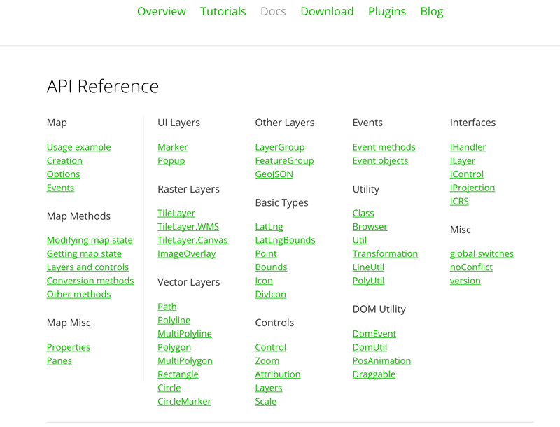](http://leafletjs.com/reference.html)  
**Figure 01.** The Leaflet API Reference, [http://leafletjs.com/reference.html](http://leafletjs.com/reference.html)

Leaflet's codebase is also maintained and accessible through Github: [https://github.com/Leaflet/Leaflet](https://github.com/Leaflet/Leaflet). This means that we can see the JavaScript running Leaflet, and if we wanted to, contribute to the project by creating a function or object and push it up as a pull request. 

Leaflet also supports a wide variety of user-contributed plugins (which extend Leaflet's functionality), most of which can be found here: [Leaflet Plugins](http://leafletjs.com/plugins.html).

## Learning to read the  Leaflet API

 **API** is another hot techie buzz word you'll hear bantered about the geoweb dev world. Often people using it don't know what it means. API stands for **Application Programming Interface**. 

What is an Application Programming Interface? We can think about two types of interfaces we deal with in web mapping and development. The first one is the interface between the human (a.k.a. the "user") and the machine. This is the Human-Computer Interface (HCI). This interface exists in terms of the visual display on a computer and other tactile devices such as a mouse, trackpad, keyboard, or touch-screen. This is the interface that we as information designers are most concerned with (e.g., providing a clear point of entry or "call to action" for using a map, giving the user feedback when they click on something so they know they've succeeded in their task, etc). 

There's a second interface at play in all this though, and that one is an interface between different computer software applications (the *application* programming interface). While we often think of computers as a monolithic whole, a computer system is far from a unified system with a single programming running. Instead, various programs are running simultaneously to allow software applications and hardware to all work together. APIs are what allow these various components of a computer system to do this. APIs essentially translate computer routines and software outputs for one another so they can talk to each other. 

An "open" API means that this Application Programming Interface has been exposed and documented so we can access it in specific ways. And if you don't follow the rules of access, strange things can happen.

In the case of Leaflet, we have our *.html* file that contains the JavaScript we're writing within it. We have our web browser, which knows how to interpret all that code to do things like draw markers on maps and generate a popup when a user clicks on a marker. The Leaflet API gives us access to that underlying code and allows us to write JavaScript that will be used among the computer system components.

Let's start by learning some of the basics of how Leaflet makes maps within our web browser.

## The Leaflet map object

The first thing we want to understand is the [Leaflet map object](http://leafletjs.com/reference.html#map-class), which the Leaflet API Reference documents as the "central class of the API — it is used to create a map on a page and manipulate it." 

We haven't talked much about what "classes" are, but for now just think of them as a kind of template from which specific instances of a map object can be created. 

Leaflet provides a simple example of using this class, which we'll now unpack a bit conceptually. Let's look at the example, drawn directly from Leaflet's API Reference, which you'll hopefully recognize from previous labs as well:

```javascript
// initialize the map on the "map" div with a given center and zoom
var map = L.map('map', {
    center: [51.505, -0.09],
    zoom: 13
});
```

**NOTE:** This lesson will detail the Leaflet API map and methods. We'll discuss the `L.tileLayer` below, but you may wish to include a tile layer through these examples to better "see" the map (zoom levels, centering, etc). So you'd want to include the code snippet that requests the web map tiles and adds them to the map. For example:

```javascript
var map = L.map('map', {
    center: [51.505, -0.09],
    zoom: 13
});
var tiles = L.tileLayer('http://{s}.tiles.wmflabs.org/bw-mapnik/{z}/{x}/{y}.png', {
        maxZoom: 18,
        attribution: '&copy; <a href="http://www.openstreetmap.org/copyright">OpenStreetMap</a>'
    });    
map.addLayer(tiles);
```

We recognize the `var map`, which is JavaScript's way of declaring a variable. So far in this course, we've been assigning various data types to variables: boolean, string, or number values, or more complex data structures such as an array or even a function. But what is being assigned here to the variable `map`?

The capital letter `L` stands for `Leaflet`, and is a top-level object (or "class" as stated above) from which all of Leaflet's awesome functionality is accessed. Do you recognize what follows the `L` (i.e., a dot, connecting an object to a name followed by two parentheses)? If we remove the method's arguments for a moment it may be more familiar:

```javascript
var map = L.map();  // just an example, will not work!
```

The two parentheses indicate that it may be a function, but it's connected to an object using dot notation. What is it? That's right, it's a method!

So `.map()` is a Leaflet method. It isn't simply native JavaScript, but when its attached to that capital `L` it means something special: that it is accessing the Leaflet library. There are particular properties of the Leaflet object (accessible through that capital L), and the `.map()` method is one Leaflet method that gives us access to those properties.

Let's look at this particular method more closely, along with the arguments we can pass to it. Again, the Leaflet API Reference tells us about how to create it (Figure 2). We see that the method is written with two parameters (the green text in Figure 02) the first required (id) and the second optional (options). We know that the second is optional because of the question mark at the end. As we read this API when making maps with Leaflet, remember that an optional argument is written with a question mark after it.

We can also see from the API reference what kind inputs these parameters want. This is the information with the angle brackets `< >`. In the case of the required id parameter, it could be either a `HTMLElement` or a `String`.  Note: remember that the `|` character stands for OR in computer programming.

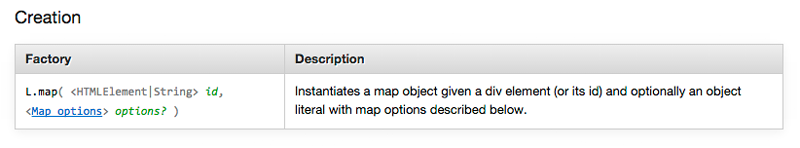  
**Figure 02.** API Reference Documentation for creating a Leaflet map object.

### The first parameter (`id`)

Referencing our code in Figure 03 (below), how does this method work? On line 70 you can see the use of the `L.map()` method which is defining a parameter call map which &ndash; as we just outlined &ndash; has to be a string type (hence the word 'map' being written using quotations). This string must correspond to the id attribute of the HTML div element (see line 59) within which we want the Leaflet map to appear. 

This is a little confusing, because on line 70 we use the word `map` three times, but each use is actually distinct and a different data type within the JavaScript. 

* The first `map` is a JavaScript variable we're using to reference the Leaflet map object. Hence the `var`.
* The second `map` is the name of a particular Leaflet method, e.g., `L.map()`.
* The third `map` is the name of the target HTML `div` element's `id` attribute that was defined on line 59. This is where the map we are making actually appears within the DOM.

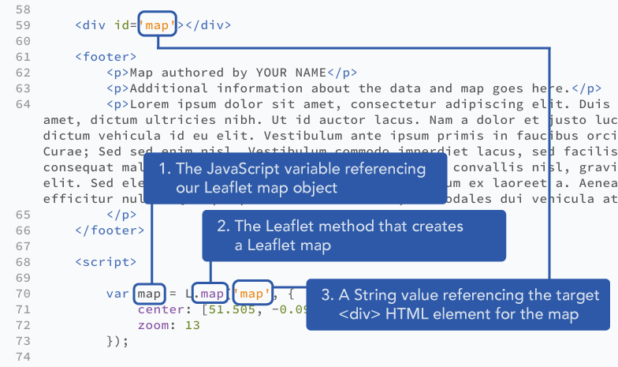  
**Figure 03**. Explanation of the three uses of 'map' in creating a Leaflet map.

### The second parameter (options): center and zoom

Let's now return to the arguments of Leaflet's `map` method call. We see in Figure 02 that beyond designating the target `<div>` element, the method also takes one additional (and optional) argument that is rather confusingly referenced as `Map options`.  Remember that the question mark at the end of `options?` indicates that it is an optional rather than required argument. What is the data type of this argument? Hint: it's contained within curly braces and comprises comma-separated properties distinguished by a key and a value, separated by a colon.

In other words it is a JavaScript object!!! Remember this: options are passed to Leaflet methods as JavaScript objects.

Consider this code again and recognize that there are two arguments being passed within the `L.map()` method:

```javascript
var map = L.map('map', {
    center: [51.505, -0.09],
    zoom: 13
});
```

The second argument we are passing to Leaflet's `L.map()` method call is a JavaScript object with two properties, one with a property name of `center` with an associated value of an array (containing two coordinate values, `[51.505, -0.09]`), and a second property with a name of `zoom` with an associated value of the number `13`. Conceptually this is easy to grasp: we're 1.) setting the center of the map to be latitude 51.505, longitude -0.09 and 2.) a map zoom level 13.

Encoding the latitude and longitude values within a simple array form is familiar to us. But if we read the Leaflet API Reference, we note that the [value's type for the `center`](http://leafletjs.com/reference.html#map-center) property is a `LatLng` type (Figure 04), not an array containing two coordinate values. 

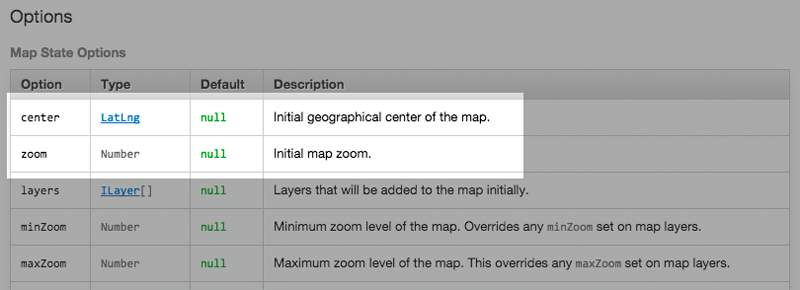  
**Figure 04.** Leaflet API Reference for Map State Options.

What's a `LatLng` data type!? Turns out this isn't a native JavaScript type either, but is actually referring to another Leaflet object, linked to from within the Reference: ([L.latLng](http://leafletjs.com/reference.html#latlng)). Note that Leaflet's `map` method also accepts simple arrays with the latitude and longitude within them, so we don't need to create a new Leaflet object to center our map. However, this object will be used throughout Leaflet map development, so it's best to grasp what how the `LatLng` object is different than a normal array containing two coordinate values.

Sometimes we do want to make use of this `LatLng` object because it allows for other useful methods. In other words `L.latLng()` is creating objects that are `more` than just arrays. If we wanted to use the [Leaflet `.latLng()` method](http://leafletjs.com/reference.html#latlng) with our map options, it would go like this:

```javascript
var mapCenter = L.latLng(38.0489,-96.5025); // defining a variable using L.latLng()

var map = L.map('map', {
    center: mapCenter,  // using this variable to center our map
    zoom: 4
});
```

Again you might think this this is overkill &ndash; after all the first example using the native JavaScript array `[51.505, -0.09]` works just fine &ndash; but using the `L.latLng()` method let's you do cool things such as calculating the distance between points.  Try this code and see what happens (**hint: this example will be used in Lab 07**).

```javascript
var mapCenter = L.latLng(38.0489,-96.5025);
var otherCity = L.latLng(38.1489,-96.5125);
var distance = mapCenter.distanceTo(otherCity);
console.log(distance); // will output distance between cities in meters
```

In this example, `distanceTo()` is a Leaflet method we can use on a `LatLng` object to calculate the distance between it and another `LatLng` object.

Finally, note that we can also store a reference to the `map` method's second optional argument (with the center and zoom properties) within a variable, which highlights that we're working with a JavaScript object, and not an object specific to Leaflet:

```javascript
var options = {
    center: [38.0489,-96.5025],
    zoom: 4
}
var map = L.map('map', options);
```

This example may help us understand that the options are stored as a JavaScript object (i.e., properties of name/value pairs).

### More properties for the second parameter (options)

Within Leaflet's API Reference, the properties contained within this second parameter, this object, are known as "options." [Leaflet's map object has a lot of options](http://leafletjs.com/reference.html#map-options) to play with, organized under such categories as "Map State Options", "Interaction Options," "Keyboard Navigation Options", "Panning Inertia Options", "Control Options," and "Animation Options."

How do we add additional options to a Leaflet map? The first way is to simply add additional properties to that second argument (i.e., to the object) when we create (or "instantiate") the map. The second way is to do so after the map object has been instantiated, with a method. Let's practice the first one now, as well as how to read the Leaflet API Reference by applying a couple options to our Leaflet map. 

Upon inspecting the Reference we note there are a couple options named `minZoom` and `maxZoom` (Figure 05).

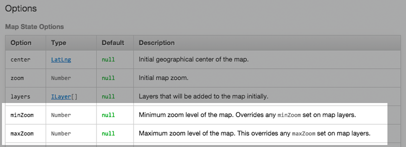  
**Figure 05.** The minZoom and maxZoom options of Leaflet's map object.

Under the first column of "Option," the Reference provides the property name of each option (which will be used on the left side of the colon within the JavaScript object). The second column of "Type" refers to the data type to be used for the property's value (in this example of Map State Options we see these are `LatLng`, `Number`, `ILayer`, and Number types). 

The reference also provides the "Default" value for each option. If we don't define these properties, these options are applied when the map object is created, (and in the case of the `minZoom` and `maxZoom` options, are assigned the default value of `null`, which means there is no limit to the zooms beyond the capabilities of the map tiles. Each option also includes a "Description" as well. 

We can override the default values of the `minZoom` and `maxZoom` options like so:

```javascript
var options = {
    center: [38.0489,-96.5025],
    zoom: 4, // initial zoom level
    minZoom: 4, 
    maxZoom: 7
}
var map = L.map('map', options);
```

This prohibits the user from zooming farther in our out than we wish (and, depending on the goal of the map, why would we want the user to have free range over so many zoom levels?). These are some subtle cartographic design decisions at work. With the addition of these option rules, we are constraining users to a particular view to that which we wish to emphasize (i.e., a particular area of the map).

Leaflet provides many options for us to play around with. For instance, we could disable the panning of the map altogether with the `dragging` option and a boolean value of `false`. Of course, it seems a bit odd to disable panning but still allow the user to zoom in, so you'd probably want to constrain the zoom level as well in most cases, or remove the default zoom control on the map with a `zoomControl` option with a value of `false`. Try it out and see what happens to your ability to shift the map.

```javascript
var options = {
    center: [38.0489,-96.5025],
    zoom: 4,
    minZoom: 4,
    maxZoom: 7,
    dragging: false,
    zoomControl: false
}
var map = L.map('map', options);
```

These are just a few rules supplied to the first statement of making a Leaflet map.

### Putting events (user interaction) into your map

Continuing to read through the Leaflet API Reference, we see that the Leaflet map makes many map "Events" available to us ([http://leafletjs.com/reference.html#map-events](http://leafletjs.com/reference.html#map-events). These include such user interaction (UI) events as clicking and dragging on the map, changing the zoom level, and adding or removing different data layers from the map. We also notice that the Reference tells us we "subscribe to the following events using [these methods](http://leafletjs.com/reference.html#events)," which links us to the `Events methods` documentation within the API Reference. We won't spend too much time on these now, but let's implement the basic example shown to get a sense for what's possible?

```javascript
map.on('click', function(e) {
    console.log(e.latlng);
});
```

Because the variable `map`, used in this example, was created using Leaflet's `.map()` method, the `.on()` method is referencing a Leaflet map object. The `.on()` method takes two arguments, the first being a String designating what kind of user interaction the method is "listening" for. In this case it's a mouse "click" event. There are a whole bunch of events that can be monitored such as double clicks, button pushes, etc. See ([http://leafletjs.com/reference.html#map-events](http://leafletjs.com/reference.html#map-events)).

The second argument is a bit more complicated. It's a function, though not written like we've seen quite yet. It's not a typical function declaration, because there appears to be no function name and hence is called an **anonymous function**. Written as is, as an `on` method's argument, this function is actually invoked immediately when the user interaction event (e.g., "click") occurs. It is also referred to as a **callback function**. The function call passes an argument as well, its corresponding parameter here written as `e` for "event" (though note that we could really use another letter or word here other than "e"). The example above will log to the Console the `LatLng` object encoding the latitude and longitude location where the user has clicked on the map.

We now have a way of capturing user input (i.e., user interaction)!

### Putting "methods for modifying map state" into your map

Let's continue with those methods categorized under [Methods for Modifying Map State.](http://leafletjs.com/reference.html#map-set-methods) These methods can be used to apply or update some of the map properties we've already looked at using Leaflet's options. 

For example, we can center the map and set it to a particular zoom level using the `setView()` method. Again, looking closely at the API Reference, we see that the `setView` method requires one argument (the `LatLng` object used to center the map), and two optional arguments (a Number for a zoom level and another set of options called 'zoom/pan options,' which we can ignore for now).

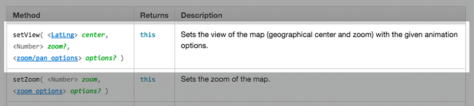  
**Figure 06.** Leaflet's setView method.

Think of Leaflet's "Options" as properties you set when the map is initialized (i.e., when the `map` method is first called and the Leaflet map object is instantiated), and Leaflet's map "methods" as setting these options at a later time in the script. For example, if we don't set the center and zoom when we first create the Leaflet map object, we can do it later using the `setView()` method:

```javascript
var map = L.map('map');
map.setView([38.0489,-96.5025], 4);
```

While this may not initially seem useful, consider the case when we allow the user to click and zoom into various places on a map.

### Putting "methods for getting map state" into your map

Beyond setting the map state (i.e., it's geographical center or zoom level), there are also Leaflet methods for retrieving information about a map state, categorized in the Reference under [Methods for Getting Map State](http://leafletjs.com/reference.html#map-get-methods). Let's consider three of these, `getCenter()`, `getZoom()`, and `getBounds()`:

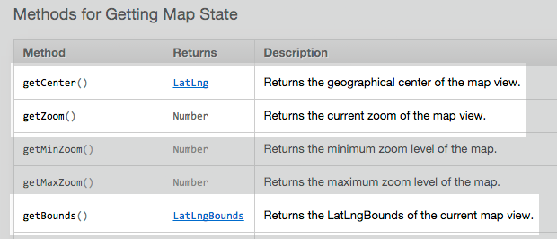  
**Figure 07.** Leaflet's Methods for Getting Map State.

We notice that each of these returns something different. The `getCenter()` method returns a Leaflet `LatLng` object, (which we've already seen) and represents a geographical point with a latitude and longitude value (see its documentation here: [http://leafletjs.com/reference.html#latlngbounds](http://leafletjs.com/reference.html#latlngbounds)). The `getZoom()` method returns a Number value representing the current zoom level of the map (whew, that one is easy enough!). The `getBounds()` method returns a `LatLngBounds` object, which represents a geographical area of a map (see its documentation here: [http://leafletjs.com/reference.html#latlngbounds](http://leafletjs.com/reference.html#latlngbounds). In practical terms, it is providing the Northeast and Southwest corners of a box from which we can derive the extend of a map. Let's first write the following code into our script and examine the output in the Console:

```javascript
var center = map.getCenter();
console.log(center); // returns a LatLng object
var zoom = map.getZoom();
console.log(zoom); // returns a Number
var bounds = map.getBounds();
console.log(bounds); // returns a LatLngBounds object
```

In the Console, we see that in fact we have logged three different values types, what's been logged as `o.LatLng`, `4`, and `o.LatLngBounds` (Figure 06):

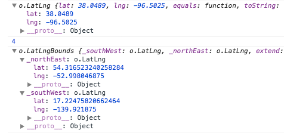
**Figure 08.** Console output from logging return values from  `getCenter()`, `getZoom()`, and `getBounds()` methods.

Let's look closely at the first one (for now just ignore the `_proto_` stuff we don't recognize). While the first and third lines of Console output may at first look fairly cryptic to us, look closely to see that they are merely JavaScript objects (again, recognize the curly brackets that contain comma-separated properties of key/value pairs separated by a colon). The first one, `o.LatLng`, is fairly simple and has two properties with names of `lat` and `lon`. So … we could modify our `console.log` output to access these values directly. Just like we did in the last task.

```javascript
var center = map.getCenter();
console.log(center.lat, center.lng); // outputs the specific latitude and the longitude values
```

The return value of the Number type for `getZoom()` is easy enough to work with since it is already output as a Number value, `4`. 

But what about this return value of `LatLngBounds`? This one seems a bit more complicated. From our earlier console log, we can see that the `o.LatLngBounds` object's first two properties are themselves objects, curiously named with a preceding underscore, `_southWest` and `_northEast`, each of which contain latitude and longitude values for their properties:

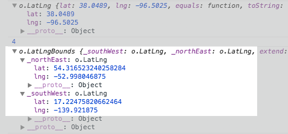
**Figure 09.** Closer inspection of the output of the `LatLngBounds` object

What do these underscores mean? While we could access the individual latitude and longitude values using dot notation like above (i.e., `console.log(bounds._southWest.lat)`), this is not intended within Leaflet. The underscore is a hint to remind us that there's actually a Leaflet method available to us for accessing these values. Indeed, if we compare the [documentation of the returned `LatLng` object](http://leafletjs.com/reference.html#latlng) with that of the [`LatLngBounds` object](http://leafletjs.com/reference.html#latlngbounds), we see that the `LatLng` provides `properties` of `lat` and `lng` for accessing these values directly using dot notation (just like we can access the length of an array using the array property of `length`, e.g., `myArray.length`). 

In contrast, the `LatLngBounds` object does not. Instead it provides various methods for returning the `LatLng` objects of the bounding box's four corners:

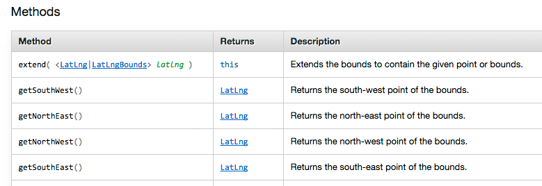
**Figure 10.** The methods available to Leaflet's `LatLngBounds` object

So, if we wanted to access the individual latitude and longitude values of the extent of our Leaflet map's current view port, we could write the following JavaScript:

```javascript
var bounds = map.getBounds(); // returns the LatLngBounds object
var bottomLeft = bounds.getSouthWest(); // returns a LatLng object
console.log(bottomLeft.lat, bottomLeft.lng); // outputs the lat and lng values
```

The key thing to remember here is that we need to look closely at the API Reference to determine subtle differences between Leaflet's objects. While the `LatLng` object provides properties for accessing `lat` and `lng` values, the `LatLngBounds` object provides methods to do so. So, when you're running into errors or wondering how to access certain data or object properties, be sure to closely examine the Leaflet API Reference

### Putting "methods for layers and controls" into your map

Okay … we're not having quite enough fun yet, so let's move on to Leaflet's next set of methods, "Methods for Layers and Controls," found here [http://leafletjs.com/reference.html#map-stuff-methods](http://leafletjs.com/reference.html#map-stuff-methods).

You may notice that the starter template and lab `.html` files you've been using so far actually have one of these methods, the `addLayer` method.

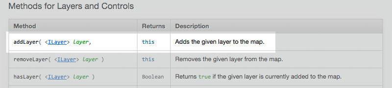
**Figure 11.** Add Layer method.

Specifically, we've been using the `addLayer()` method to add a raster tile set to the map, which we've been using as our basemap. Remember this bit of code in your tasks? 

```javascript
var tiles = L.tileLayer('http://{s}.tiles.wmflabs.org/bw-mapnik/{z}/{x}/{y}.png', {
        maxZoom: 18,
        attribution: '&copy; <a href="http://www.openstreetmap.org/copyright">OpenStreetMap</a>'
    });    
map.addLayer(tiles);
```

This method is straightforward. It's attached to the `map` variable via dot notation `.addLayer()` and passes one argument.  In this case it is a `tileLayer` object which we have named `tiles`, that includes methods which load 256 x 256 pixel raster map images we use as the "slippy" reference basemap. 

Let's have a closer look at Leaflet's `tileLayer()` method (documentation is found here: [http://leafletjs.com/reference.html#tilelayer](http://leafletjs.com/reference.html#tilelayer)). The `tileLayer()` method passes two arguments: the first being a URL address to a public tile service, and the second being an object containing a number of Leaflet options.

The magic of these "slippy" tiled base maps involves our ability to request pre-built tile sets and use them in our maps. Thus by changing one line — the URL to a set of tiles — you can change what the background of your map looks like.

Fortunately there are many good ones to choose from. You can explore various tile sets available to load within a Leaflet map here: [http://leaflet-extras.github.io/leaflet-providers/preview/](http://leaflet-extras.github.io/leaflet-providers/preview/). This fun viewer even provides a code snippet you can cut and paste into your script. Feel free to experiment with various tile sets.

## UI Layers

The web mapping libraries supported by Leaflet, Mapbox, and CartoDB all offer us the capacity to quickly and easily load various tiled base maps into a map. Additionally, these libraries offer easy and and zoom functionality using these base maps, "out of the box". This is terrific. But as web cartographers we're also interested in the information we put on top of these basemaps ( most often points, lines, and polygons) to make thematic maps. We'll now explore how we draw data to the map using Leaflet.

### Leaflet markers

Let's start by looking more closely at the default markers we've been using for Leaflet maps. They are documented here: [http://leafletjs.com/reference.html#marker](http://leafletjs.com/reference.html#marker).

Similar to creating a Leaflet map object, we create a Leaflet marker object by using the capital L and dot notation. 
```javascript
var map = L.map('map', {
    center: [51.505, -0.09],
    zoom: 13
});
```

But in this case we use the `marker()` method:

```javascript
L.marker([38.0297, -84.4947]).addTo(map); // places a marker on Lexington
```

How do we know what to include within these parentheses? 

We see in the API Reference that this method accepts two arguments. The first one is required and is a `LatLng` object. The second argument, similar to the `map()` method, is an object of options pertaining to the marker object we're creating. But since were creating a marker rather than a map these options will be different than the options we can apply to the Leaflet `map` object. Given that the second option is optional, let's first just put a marker on the map using no options:

```javascript
var redIguanaLocation = L.latLng(40.7718,-111.9124);
var redIguanaMarker = L.marker(redIguanaLocation);
redIguanaMarker.addTo(map);
```

Really simple but really powerful.

Here the first line creates a new `LatLng` object using the coordinates of the Red Iguana Restaurant and stores a reference to it in the variable `redIguanaLocation`. The second line passes a reference to that object as an argument when calling the `marker()` method (effectually passing that value as the argument). The third line then uses the method `addTo()` to add that marker to the map (we'll look at the `addTo()` method of the `marker` object in a moment, but it's similar to the `addLayer()` method we just looked at). 

### Leaflet marker options

Above we learned how to use options with the `map()` method. Now we can use the same principles to apply options to the `marker` object. Where do you get a list of all the options?

Again, we need to refer to the [Leaflet documentation  for the `L.maker object`](http://leafletjs.com/reference.html#marker). Let's play with a couple of these (though we expect you to experiment with others yourself). Let's include the `draggable` and `opacity` options when we first create (or "instantiate") the marker. What do these do? Let's [consult the reference](http://leafletjs.com/reference.html#marker-draggable) and see what the description says.

The `draggable` option has a default value of `false` and determines "`Whether the marker is draggable with mouse/touch or not.`" The `opacity` option has a default value of `1.0` (meaning 100% opacity) and determines "`The opacity of the marker.`"

Modify the code so that it looks like this:

```javascript
    var redIguanaLocation = L.latLng(40.7718,-111.9124);
    var redIguanaMarker = L.marker(redIguanaLocation, {
        draggable: true,
        opacity: .4
    });
    redIguanaMarker.addTo(map);
```

Changing the marker's default `draggable` option to true and the `opacity` to .4 (valid `opacity` values in Leaflet range from 0 to 1), allows the user to drag the marker around the map, as well as makes it fairly transparent. 

### Leaflet event methods

There are also a number of events which we can attach to Leaflet markers. Events are things that can "happen" on a page to an object such as the map object or marker object. For example, a user can click somewhere, or click and drag, or double-click etc. When we attach these events to a marker (or any other Leaflet object), it means that that marker will then "listen" for these events. When an event happens, it will pick up on it and subsequently execute some pre-defined code.

Many of the marker events are named similarly to the events we can use with the Leaflet `map` object such as `'click'`, `'doubleclick'`, and `'mousedown'`, though others such as `popupopen` pertain solely to marker objects. Again, to use these events we need to make use of (Event methods](http://leafletjs.com/reference.html#events)). 

The most useful of these Event methods which is the `on()` method. For example, suppose we want to log to Console the location of the marker while we're dragging it. After making the `draggable` option true (btw, notice that we're not including the opacity option here and the marker looks different), we can use the 'drag' event's callback to log its `LatLng`:

```javascript
var redIguanaLocation = L.latLng(40.7718,-111.9124);
var redIguanaMarker = L.marker(redIguanaLocation, {
    draggable: true   
});
redIguanaMarker.addTo(map);
redIguanaMarker.on('drag', function(e) {
        console.log(e.target.getLatLng());
});
```

Let's again inspect all that data showing up in the Console. 

The `e.target` bit might be a little confusing at first. Again, this is where the Leaflet documentation helps us out. Go to [http://leafletjs.com/reference.html#event-objects](http://leafletjs.com/reference.html#event-objects). You see there that `e` holds the event object, which has two properties: the type of the event (in this case 'drag') and the target. In our case, the object that 'fired' the event is the redIguanaMarker. So accessing `e.target` is functionally the same as accessing the redIguanaMarker directly! That's why we can use the `getLatLng()` function here — it's a method available to any Leaflet marker ([http://leafletjs.com/reference.html#marker](http://leafletjs.com/reference.html#marker)).

You should recognize another `marker` method in the API Reference named `bindPopup()`. We've been using this the past couple of labs to fill the Leaflet marker popups with content. 

```javascript
var redIguanaLocation = L.latLng(40.7718,-111.9124);
var redIguanaMarker = L.marker(redIguanaLocation);
redIguanaMarker.addTo(map);
redIguanaMarker.bindPopup("Best Mexican food in Salt Lake City!");
```

Looking now at the API reference (scroll down to the methods section of markers), we see that the first argument of the `bindPopup()` method can be either a string of text (interpreted as HTML text) OR HTML elements (e.g., "`<div class='colorValue'>`…"), which is how we've been using it, OR a Popup. What is this third possibility? 

The `marker`'s `bindPopup()` method is actually invoking another Leaflet method, `popup()`, documented here: [http://leafletjs.com/reference.html#popup](http://leafletjs.com/reference.html#popup), which creates a Popup object. The `bindPopup()` method allows you to create this object first, and then bind it to a marker. The Popup has numerous options as well (feel curious and play with them!).

And now for a further point of clarification. Perhaps you've noticed, within the scripts we've been working with so far in class, the following code:

```javascript
L.marker([40.21,-88.154]).addTo(map).bindPopup(popup);
```

What we're looking at here are three methods, ``marker()`, `addTo()`, and `bindPopup()` which have been chained together to one another using dot notation. This is known as "method chaining," as each method is chained to its predecessor. This is a very efficient way of writing code, but also can be a bit confusing the first time you see it.

How this works: the ``marker()` method is called first and returns a Leaflet ``marker()` object. The `addTo()` method is then applied to that return object, which adds it to the map (the ``marker()` object remains the return object). The `bindPopup()` method is then applied to that ``marker()` object. The result of this code is exactly the same as writing this more verbose version:

```javascript
var city =  L.marker([40.21,-88.154]);
city.addTo(map);
city.bindPopup(popup);
```

Both will work but the method chaining approach is more compact and is also what you'll most likely to see in other people's code.

## SVG Vector Layers

Leaflet's default markers, while sometimes appropriate, have limited utility for us as web cartographers. Sometimes we want something more than just a place mark marking a point.

Drawing various vector objects allows us to represent a wider range of geographic phenomena than simple point markers. This section of the module introduces Leaflet's capacity to draw vector layers using SVG (Scalable Vector Graphic), which is a text-based web standard similar to HTML used for describing vector graphics and text.

### Vector vs. raster

As a refresher, what's the difference between vector and raster? In the simplest of terms, vector representations of geographies use points, lines, and polygons, while raster representations use gridded cells of varying colored values (i.e., raster stores information as images). So far we've just been using raster imagery in Leaflet in  different ways. Can you think of what they are?

* The first way are the raster tile images we bring in to use as our basemap. You now know how to do this and can bring in a publicly available set of tiles (or even make you own if you are really ambitious).
* The second way are the Leaflet markers (that we're perhaps getting tired of seeing). These markers are simply small raster images we're placing on the map.

### Leaflet's vector layers - example of the circle class

Leaflet makes some basic vector geometries available as SVG elements. [Leaflet's API Reference](http://leafletjs.com/reference.html) refers to these as "Vector Layers": `Polyline`, `Multipolyline`, `Polyline`, `Polygon`, `MultiPolygon`, `Rectangle`, `Circle`, and `CircleMarker.` It's useful to remember that Leaflet considers every individual vector object its own "layer" … so if you have a collection of Leaflet circles, each one is considered its own layer (i.e., if you draw a dataset of 20 cities as markers or circles, each city will be its own layer).

We'll begin playing with vector graphics in Leaflet with the `Circle` class ([http://leafletjs.com/reference.html#circle](http://leafletjs.com/reference.html#circle)).

The API Reference tells us that we create a new instance of a Leaflet `Circle` by using a `circle` method: (i.e., `L.circle()`) with which we can pass two required arguments (a `LatLng` object for the location of the circles center and a Number for the radius of the circle, in meters). Let's say we've learned that the [Red Iguana Restaurant](http://www.rediguana.com/) is cooking a new batch of pork green chile, and we can smell the deliciousness from 400 meters away. How can we represent this incredibly important geography visually on a map? 

Here's a JavaScript solution using Leaflet:

```javascript
var redIguanaLocation = L.latLng(40.7718,-111.9124);
var redIguanaCircle = L.circle(redIguanaLocation, 400);
redIguanaCircle.addTo(map);
```
This code first creates a `LatLng` object to hold our location data and stores that as the variable `redIguanaLocation`. The second statement then passes that object as the first argument within the `circle` method, and passes the Numeric value of `400` as the second argument (the [Leaflet documentation tells us that the radius of the `L.circle` object](http://leafletjs.com/reference.html#circle) is given in meters). This statement then assigns the return value to the variable `redIguanaCircle.` 

What's the data type of this return value assigned to `redIguanaCircle`? 

It's a Leaflet `L.circle` object. The next statement then adds this `L.circle` object to the map using the `addTo()` method. When we refresh our browser (and perhaps zoom into the location) we see a basic Leaflet SVG `Circle` placed at the location of the Red Iguana Restaurant. 

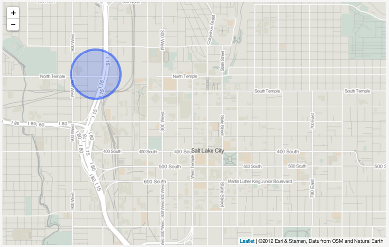  
**Figure 12.** A Leaflet map with a Leaflet Circle with default style options.

Try creating a few more circles on your map. Play with the radius option passed within the method call `L.circle()`.

### Understanding path options and extend/inheritance

The [API reference](http://leafletjs.com/reference.html#circle) also shows that a third optional argument we can pass using the `circle` method are `<Path options> *options?*`. 

What are `Path options` and why are we not passing options specific to the `Lcircle` class in the previous examples? Second question first: that question mark after the `*options?*` indicates they are optional.

So what are the path options then? If we look closely at the API, we see that it tells us that the Leaflet `L.circle` class "Extends [Path](http://leafletjs.com/reference.html#path)".

To understand what this "extends" means, we need to take a moment to understand a fundamental concept in computer science and programming: that of *inheritance*. Remember when we talked about a "class" being a kind of template from which specific instances of that class can be constructed? 

The classic metaphor for a class is that of the blueprint of a house. The blueprint provides for basic instructions about how many rooms are in the house, how the doors open, where the iguana run is placed, where the kitchen is located, if there is a garage, etc. We can take this blueprint—this class—and then build (or "instantiate," in computer lingo) many different instances of this house. And when we do, we don't need to follow the blueprint exactly. Maybe we paint one house red and the other blue. Perhaps we include a garage on one house, or use beaded curtains instead of a swinging door on another. 

In other words, there is a plan one follows but within the plan are many different points where we can select options. This is how Leaflet's classes (and all classes in computer programming) work. 

The Leaflet `Map` class provides a blueprint for making many different kinds of maps. The same thing holds true for Leaflet's `Circle` class.  We can use it to make many different kinds of circles, but all of these circles have the characteristics provided for by the blueprint (or, the JavaScript code underlying the Leaflet library). And the cool bit is we can also modify and customize the specific instances of these circles.

Okay, what about this "extend" business then? Returning to our house blueprint metaphor, suppose we want to build a houseboat. We don't need to start from scratch, because we already put a lot of work into a blueprint for building many parts of a house. We want our houseboat to also have a kitchen, a bathroom, a bedroom, and doors, just like the house. But we also what our houseboat to have additional features (such as iguana diving board) and functionality. So, we create a houseboat blueprint that extends the blueprint of the house to keep all of the  features of a house, but will also include the features and functionality of the boat.

The Leaflet `Circle` class "Extends [Path](http://leafletjs.com/reference.html#path)," so we need to look more at the `Path` class to understand what's available to our `Circle` class.  Following this metaphor, the `Path` class is the house and we want to extend it to have the properties of the house plus additional Again, just as the houseboat would inherit all the features and functionality of the house, so to will `Circle` will inherit all of `Path's` options, events, and methods. 

As always we start with a look at the [API Reference for path](http://leafletjs.com/reference.html#path). 

First, notice that the API Reference informs us that the `Path` class is: "An abstract class that contains options and constants shared between vector overlays (Polygon, Polyline, Circle). Do not use it directly." So we won't see some "Factory" method for its creation (don't worry about what Factory means right now), like we have with the other classes so far (e.g., `L.map()`, `L.marker()`, `L.circle()`). Instead, Leaflet uses the `Path` class as a blueprint for extending the other classes (e.g., `Polyline`, `Polygon`, `Circle`, etc.). These will all inherit `Path*'s options, events, and methods.

* **OPTIONS**: The `Path` options include such things as the stroke color and weight of SVG lines, fill color and opacity of SVG polygons, and whether or not an object contructed with the `Path` class is clickable or not. 
* **EVENTS**: The `Path` events are also similar to the events we've previously seen (e.g., "click", "dbclick", "mouseover", etc). 
* **METHODS**: Path methods include a `addTo()` method (which can be used to add a vector layer to the map), a `bindPopup()` method (which behaves the same as the one used for binding popups to the Leaflet `Markers*), and a `setStyle` method which allows you to change the `Path` options after you've create an object extending `Path.` 

Remember, we can't directly create a "path" element,  but rather all these options, events, and methods are available to Leaflet objects that extend the `Path` object. So let's dive into the Leaflet Circle object to play with some of this functionality now.

### Putting path options to work in `L.circle*

Let's return to our basic Leaflet map then to apply some `Path` options to improve the circle's appearance. Keep in mind that the circle as is isn't un-styled; it has color, opacity, and a border. But rather than being defined by us, Leaflet has applied some default styles to the circle (the default options listed in the API Reference). 

There are two solutions for changing these basic styles: doing it upon object creation and after object creation.

Because the Red Iguana is red and not blue (like it's sister restaurant, the [Blue Iguana](http://blueiguanarestaurant.net/)), it would be better to make the circle red. We want to change both the stroke (or border) and fill of the circle, so we need to refer to the [Path](http://leafletjs.com/reference.html#path) documentation. Remember, we include these options as the third argument in the `Circle` class instantiation by included them as key/value pairs within an object:

```javascript
var redIguanaLocation = L.latLng(40.7718,-111.9124);
var redIguanaCircle = L.circle(redIguanaLocation, 400, {
    color: "#d72b1e",  // changes the stroke color
    fillColor: "#d72b1e"  // changes the fill color
});
redIguanaCircle.addTo(map);
```

When we save our changes and refresh the map, voila! We've now changed the color styles of the SVG circle (Figure -02). We are boss!

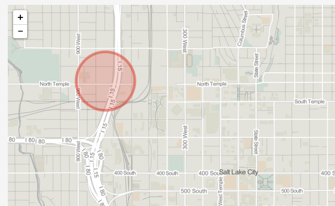  
**Figure 13.** Leaflet `Circle` with stroke color and fill color styled as red.

Note that can also update the styles of a Leaflet vector layer after we create it (similar to how we can update the properties of a Leaflet `Map` object after we create it). This example demonstrates changing the styles of our `Circle` using the `setStyle` method inherited from the `Path` class (and modifies the default values for the stroke width and fill opacity):

```javascript
var redIguanaLocation = L.latLng(40.7718,-111.9124);
var redIguanaCircle = L.circle(redIguanaLocation, 400);
redIguanaCircle.addTo(map);

redIguanaCircle.setStyle({
    color: "#d72b1e", // sets stroke color to red
    weight: 15, // sets the stroke width to 15 pixels
    fillColor: "#d72b1e",  // sets fill color to red
    fillOpacity: 1  // sets the fill opacity to 1
});
```

We can save and refresh the browser to see the results (Figure -03).

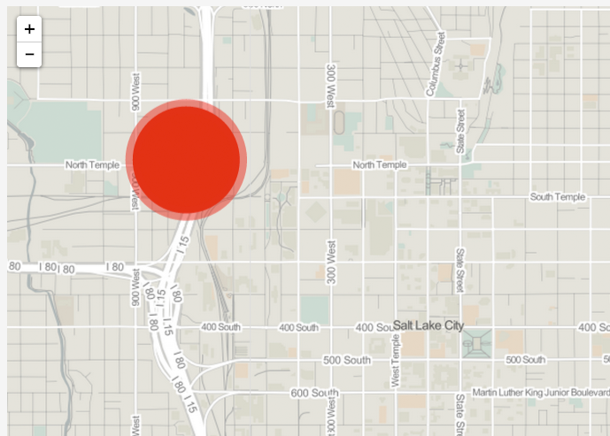  
**Figure 14.** Circle with thicker stroke with and fill color set to opacity 1

The `Circle` class also has its own methods that don't belong to `Path`. This is where  `Circle` class *extends* the `Path` class. These include methods for getting the latitude and longitude of the circle's center point, getting the circle's radius, as well as (re)setting these values. Consider the following code, which first creates an "empty" `Circle` object and then supplies the location coordinates and radius:

```javascript
var redIguanaLocation = L.latLng(40.7718,-111.9124);
var redIguanaCircle = L.circle();
redIguanaCircle.setLatLng(redIguanaLocation);
redIguanaCircle.setRadius(400);
redIguanaCircle.addTo(map);
```

If you're paying attention, you should be saying, "Wait a minute!!!" I thought the location and radius were `required` arguments for creating a `Circle`!" Well, you're correct. While Leaflet's code allows us first instantiate a `Circle` without passing these arguments, if we tried adding it to the map we would get an error. The example above works because we've used the `setLatLng()` and `setRadius()` methods before we've added it to the map.


## Working with LayerGroup

We're going to spend more time with the other Leaflet Vector Layers in the coming weeks. To finish off this module, however, we're going to look at some functionality used in Leaflet to group layers. Remember above when we said that Leaflet treats each SVG object (and each marker element) as its own "layer?" Well, it begins to get kinda messy if we're simply adding a bunch of different elements to the map itself (especially when we start adding different sets of related geographical elements). 

To help with this, and to provide some other useful functionality, Leaflet provides some objects used to group layers together. We're going to look at a class called `LayerGroup`, which Leaflet says is used to "group several layers and handle them as one," as documented here: [http://leafletjs.com/reference.html#layergroup](http://leafletjs.com/reference.html#layergroup).

Let's continue with our mapping of delicious Mexican food in Salt Lake City to better understand how to use the `LayerGroup.` The following code first creates an empty `LayerGroup` object or something to which we can add stuff, like circles representing the delicious smells coming out of Iguana restaurants.  After creating each layer (namely our `Circle` objects) we use `.addTo` to that the layer to the `layerGroup*. We've give the Blue Iguana a slightly smaller radius because, while delicious, the aroma of its green chile doesn't travel quite as far as its sister restaurant:

Nothing really has changed to the layer (or `Circle` objects) associated with either restaurant, they are just now associated with this `layerGroup` which we can add to the map in one step at the end.

```javascript
        var iguanaRestaurants = L.layerGroup();
        var redIguana = L.circle([40.7718,-111.9124], 400);
        redIguana.addTo(iguanaRestaurants);
        var blueIguana = L.circle([40.7657, -111.8930], 300);
        blueIguana.addTo(iguanaRestaurants);
        iguanaRestaurants.addTo(map);
```


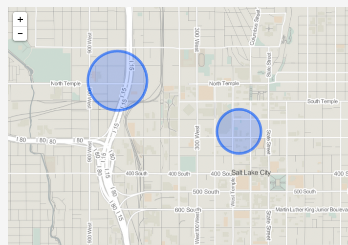  
**Figure 15.** Two Leaflet Circles added as a layerGroup.

So the `LayerGroup` object allows us to conveniently group geographic elements together. Eventually we'll be doing things like adding and removing layer groups (say, for instance, the user can toggle on and off various sets of geographic features). For now, let's look a little more closely at an important method we use with `layerGroups` (and eventually `featureGroups` and `GeoJSON` layers): the `eachLayer` method.

Leaflet's `eachLayer` method allows us iterate through all the layers within a `layerGroup` object. So, it operates like the for and while looping we've already practiced with JavaScript. Let's start with a basic example, looping through our newly created `iguanaRestaurants` `layerGroup*:

```javascript
var iguanaRestaurants = L.layerGroup();
var redIguana = L.circle([40.7718,-111.9124], 400);
redIguana.addTo(iguanaRestaurants);
var blueIguana = L.circle([40.7657, -111.8930], 300);
blueIguana.addTo(iguanaRestaurants);
iguanaRestaurants.addTo(map);

iguanaRestaurants.eachLayer(function(layer) {
    console.log(layer);
});
```

This output in the Console looks a little convoluted:

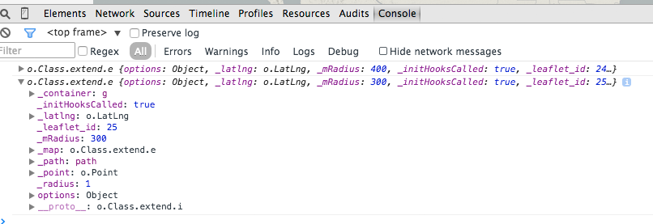
**Figure 16.** Leaflet layer output.

However, each of these layers are the Leaflet layer contained within that `layerGroup,` in this case our `L.circle` objects. So, we can treat this `layer` as the `L.circle` objects themselves and apply options, events, and methods to them. For example, let's bind a 'mouseover' event to these circles that changes their color to yellow on the hover (in User Interaction design, this is called providing an "affordance" to the user, i.e., feedback that they have triggered some kind of event):

```javascript
var iguanaRestaurants = L.layerGroup();
var redIguana = L.circle([40.7718,-111.9124], 400);
redIguana.addTo(iguanaRestaurants);
var blueIguana = L.circle([40.7657, -111.8930], 300);
blueIguana.addTo(iguanaRestaurants);
iguanaRestaurants.addTo(map);

iguanaRestaurants.eachLayer(function(layer) {
    layer.on('mouseover', function(e) {
        e.target.setStyle({
            color: 'yellow',
            fillColor: 'yellow'
        });
    });
});
```

Oohh, isn't that neat!? However, we also want the circle to change back to it's default color on mouse out, so we could add another event, a 'mouse out' event to each layer:

```javascript
iguanaRestaurants.eachLayer(function(layer) {
    layer.on('mouseover', function(e) {
        e.target.setStyle({
            color: 'yellow',
            fillColor: 'yellow'
        });
    });
    layer.on('mouseout', function(e) {
        e.target.setStyle({
            color: '#03f',
            fillColor: '#03f'
        });
    });
});
```

Now we're starting to get into some fun user interaction (UI) stuff. To finish up this module, let's say that we want to complete our map of these two iguana restaurants. Our requirements for this little example include:

1. sizing each circle according to the distance of juicy aroma
2. coloring each circle according to whether it's red or blue
3. providing a hover affordance (turning the circle yellow)
4. returning the circle's color to its original, default color

To achieve this, this example demonstrates two new (and useful) coding tricks when making maps with Leaflet. First we're storing the "options" properties for each circle in separate variables. We use this variable when we first create the circles, but we're also using to restore each circle back to its original color. Second, when we're looping through each layer, we need a way to determine which circle is which (so we apply the red style to the red circle and blue to the blue). To do this, we store a unique identifier as a property of each circle. We simply use dot notation to create a new property and assign it a respective value ('red' or 'blue'), and we've arbitrarily chosen the property name 'color' here. Then, we can use conditional logic within the `eachLayer` looping structure to determine which style to apply:

```javascript
var iguanaRestaurants = L.layerGroup();
var redIguanaOptions = {
    color: 'red',
    fillColor: 'red'
};
var blueIguanaOptions = {
    color: '#03f',
    fillColor: '#03f'
};
var redIguana = L.circle([40.7718,-111.9124], 400, redIguanaOptions);
redIguana.color = 'red';
redIguana.addTo(iguanaRestaurants);
var blueIguana = L.circle([40.7657, -111.8930], 300, blueIguanaOptions);
blueIguana.color = 'blue';
blueIguana.addTo(iguanaRestaurants);
iguanaRestaurants.addTo(map);

iguanaRestaurants.eachLayer(function(layer) {
    layer.on('mouseover', function(e) {
        e.target.setStyle({
            color: 'yellow',
            fillColor: 'yellow'
        });
    });
    layer.on('mouseout', function(e) {
        if(e.target.color == 'red') {
            e.target.setStyle(redIguanaOptions);
        } else if (e.target.color == 'blue') {
                e.target.setStyle(blueIguanaOptions);      
        }
    });
});
```

Write this final example in your code and think about it carefully. For **2pts** of your lab assignment for this week, submit the *lesson-07-data/index.html* file with this code included. Provide a JavaScript comment above each line describing what the code is doing.