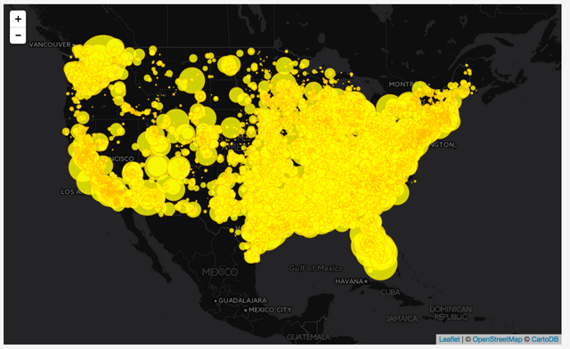

# Lab 08: Making a Proportional Symbol Map in Leaflet

To begin this lab, open the *index.html* the *lab-08-data/* directory in Brackets and follow the tutorial and instructions below, saving your work and committing changes to Git as you go.

## Proportional symbol maps

Proportional symbol maps are a useful alternative to choropleth maps used to map total or ratio data and have some important advantages (i.e., they don't have to be standardized like a choropleth map). We can use true point data to make a proportional symbol  map (such as the location of coal plant), or conceptual point data (i.e., a wind farm covers a large area but we can still represent it as a point). Proportional symbol maps are also good at showing relative magnitudes (i.e., "I can tell that this one is larger than that one"). We can make a proportional symbol maps with any shape, though circles are the most common, and we'll go with this in this lab.

To achieve proportional symbols within our Leaflet map, we'll scale the symbols using a known quantity: specifically the amount electric capacity of the plants already encoded within our GeoJSON data. We'll use this data attribute to set the radius of our Leaflet *CircleMarkers*. We can implement this directly within our *pointToLayer*'s function, as it is passed in as the `feature` parameter of this function. 

As we saw in the lesson's filtering examples, within the `pointToLayer()` function, we can access the value of the power capacity (in megawatt hours) with the reference `feature.properties.capacity_mw`. 

```javascript
L.geoJson(plants, {
    pointToLayer: function(feature,latlng) {
        return L.circleMarker(latlng, {
            color: 'orange',
            weight: 1,
            fillColor: 'yellow',
            fillOpacity: 1,
            radius: feature.properties.capacity_mw
        });   
    }
}).addTo(map);
```

Save this change and refresh the browser. What happens? Remember that some of these numeric values in the 1000s, so we're drawing circles with pixel radii in the 1000s!

While it makes sense to simply apply this value to radius (i.e., ` radius: feature.properties.capacity_mw`, we don't want to do that. There are two problems with this. First, the values of some of these numbers are quite huge (at least for specifying pixels) and as a result the circles end up filling up the entire world map. 

One simple solution to this: just reduce the value of each by an equal amount (i.e., `radius: feature.properties.capacity_mw * .01`). By the way, there is nothing magical about the number`.01`. This number works well given the the magnitudes of these particular data. We'll adjust this "scale factor" differently depending on the data.

This appears to work although it still faces the second problem of overlap.

  
**Figure 01**. Problematic proportional symbols

Before we deal with the second problem of simply applying the numeric value as the radius of each circle, we'll deal with another design problem emerging from our coded solution.

### Dealing with overlap in proportional symbols

As we increase the size of the circles we encounter a classic problem in proportional symbol mapping: ***symbol overlap***. Not only do the overlapping symbols make it difficult to determine their relative sizes, but in some cases large symbols are completely covering the smaller ones.

There are three solutions to the problem of symbol overlap, and we can achieve two of them through our custom JavaScript coding.

The first is to stack the symbols so that large ones rest visually underneath the smaller ones. We can do this with a fancy version of a [JavaScript `.sort(http://www.w3schools.com/jsref/jsref_sort.asp)` method]() which will filter our GeoJSON data before we use Leaflet to draw the SVG circles. By sorting the data values high to low, Leaflet draws the larger ones first and the smaller ones on top of them. 

To do this, place this code in your script before you call the `L.geoJson()` method.

```javascript
plants.features.sort(function(a, b) {
    return b.properties.capacity_mw - a.properties.capacity_mw;
});
```
We can't simply apply the regular JavaScript sort method to the `plants.features` because this method attempts to sort these numbers as strings, and the value of 34 would be sorted as higher than 245.

So when the symbols are drawn, the biggest ones are drawn first and are at the bottom. The visual result is somewhat of an improvement. 

  
**Figure 02.** Stacked proportional symbols with the larger ones at the bottom

A second solution, which can be coupled with stacking them with larger ones on the bottom, is to reduce the opacity of the circles' fill while retaining a high opacity of the stroke. This is easily achieved using [Leaflet's Path options](http://leafletjs.com/reference.html#path):

```javascript
return L.circleMarker(latlng, {
    color: 'orange',
    weight: 1,
    fillColor: 'yellow',
    fillOpacity: .8,
    radius: feature.properties.capacity_mw *.01
}); 
```

By reducing the opacity of the `fillOpacity` option, we're able to achieve a more legible proportional symbol map:

  
**Figure 03.** Stacked proportional symbols with reduced opacity

The third solution, available to us in an interactive web mapping environment, is to not worry about the overlap and count on the user's ability to zoom into the map to resolve the issue (especially considering these circleMarkers resize themselves on the zoom to keep the same pixel size). Fortunately, the heavy-coding required for the pan/zoom functionality is already being handled by Leaflet.

### Radius versus Area in proportional symbols

There's a larger problem with the map as it is currently coded. We've used the data values to directly scale the symbol's radii. However, when making visual comparisons as it is currently coded, our eye-brain systems don't actually compare the radii, rather we compare the areas of these circles. Thus, a plant producing 20 times more power than another doesn't appear to have 20 times the area here, but an area much higher than that (20 squared times pi). 

To make the map work with human brains and eyes we need to assume the values we want to compare are the areas and then calculate radii to create these areas and use these to draw the circles.

To implement this in our code, instead of directly assigning a value to the radius of each *CircleMarker*, let's assign the return value of a function, which will scale and calculate the radius for us. This is as simple as calling a function and passing our data value to it:

```javascript
radius: getRadius(feature.properties.capacity_mw)`. 
```

And again if we call a function named `getRadius`, we also need to write the function named `getRadius`. 

We'll do this outside of the *L.geoJson()* method call (i.e., at the bottom of our script within the global namespace). Remember the function we write needs to accept the argument we're passing, it but of course we can give it a new name in the function.  Within the function we can inverse our old formula for determining the area of a circle (remember π\*r<sup>2</sup> from Geometry class?) to get the right radius for our circles.  

Note we're using a build-in JavaScript class `Math` and its property `PI` (which stores a value of, you guessed it, 3.141592653589793). After the calculation, we can multiple the result by an arbitrary scale factor (`.6` works well for these data values and again would need to be adjusted depending on the data), and then return that value to our caller.

```javascript
function getRadius(area) {
    var radius = Math.sqrt(area/Math.PI);
    return radius * .6;  
}
```
  
**Figure 04.** Stacked proportional symbols with reduced opacity, scaled by area

Alright. Now we have a proportional symbol map! 

## Adding user interaction to each feature

Now that we've explored some ways to filter our data in meaningful ways, let's consider some basic interaction techniques. This includes providing information when a user clicks on or hovers over a symbol.

### Adding a mouseover or mouse out affordance

We provide the user with a basic "affordance", or some user interaction (UI) indication that they have manipulated the interface in some way to invoke functionality. We'll take a lot more about interaction design in MAP673, but for now, let's work on a basic example of an affordance by changing each feature when the user mouses over it.

To do this, we're going to make use of another one of the `L.geoJson`'s options, the `onEachFeature` option.  Like the `pointToLayer` and the `filter` options, the `onEachFeature` iterates through the GeoJSON data's features when we first create our Leaflet *GeoJson* layer. It's value is a function which passes the feature data for a particular feature, as well as the Leaflet layer being created. We're going to be employing both with the function's body. To start, we'll place a `console.log()` statement to inspect the output as the `onEachFeature` option loops through the GeoJSON data.

Let's start by adding this it our code:

```javascript
L.geoJson(plants, {
    pointToLayer: function(feature,latlng) {
        return L.circleMarker(latlng, {
            color: 'orange',
            weight: 1,
            fillColor: 'yellow',
            fillOpacity: .8,
            radius: getRadius(feature.properties.capacity_mw)
        });   
    },
    onEachFeature : function(feature,layer) {
        // code here
    }
}).addTo(map);
```

The [Leaflet API Reference](http://leafletjs.com/reference.html#geojson-oneachfeature) informs us that this option's value is a "Function that will be called on each created feature layer. Useful for attaching events and popups to features." So like the `pointToLayer` and `filter` options we've already explored, this one too allows us to access the feature data.

But what about this `layer` property we've written? Rather than accessing the feature data of the original GeoJSON data, the `layer` gives us access to the Leaflet SVG layer that's been drawn to the DOM. If we `console.log(layer)` within this function, we'll see the output is a much more complicated Leaflet object structure (and one we don't really want to worry about if we don't have to ... this is what the API is for!).

  
**Figure 09.** Console log of each layer with `onEachFeature`

To bind a user-generated interaction to these layers, we're going to be using the Leaflet *Path* events `mouseover` and `mouse out` ([http://leafletjs.com/reference.html#path](http://leafletjs.com/reference.html#path)), which are triggered by using Leaflet's `.on()` method:


```javascript
onEachFeature : function(feature,layer) {
    layer.on('mouseover', function() {
        // code goes in here
    });
    layer.on('mouseout', function() {
        // code goes in here
    });
}
```

Within those `mouseover` and `mouse out` events, we can use a `.setStyle()` method on each layer, passing a JS object with path methods of our choosing.

```javascript
layer.on('mouseover', function() {
    layer.setStyle({
        fillColor: 'red'
    });
});
layer.on('mouseout', function() {
    layer.setStyle({
        fillColor: 'yellow'
    });
});
```

Mousing over the symbols provides immediate feedback that the user is interacting with the symbols, and the map. This invites further interaction (such as clicking on the symbol), to let the user know they have some control over what the map is saying. This minor gesture is but a small example of how web maps have come to differ quite drastically from a static map.

### Binding the Leaflet popup to each feature.

We can also use the `onEachFeature` option to bind a Leaflet Popup to each feature. To do so, within the option's function, use the [`bindPopup()` method](http://leafletjs.com/reference.html#marker-bindpopup), a method the `circleMarker` inherits from the Leaflet Marker class. Within the popup's parentheses, as we've been seeing throughout this course, we can insert various string (html) content.

```javascript
 layer.bindPopup('hi i am a circle');
 ```

This code merely inserts the string 'hi i am a circle' within each popup. 

## Lab Assignment

Modify the script creating the current proportional symbol map to meet the following requirements **5pts**:

* filter by **one** of fuel sources
* style the circles with a stroke and fill color you associate with that fuel source (not the current values of 'orange' and 'yellow' as given in the starter file.)
* mouseover affordances should return to the original color when mousing off
* build the popup so it displays the following content:
    * the name of the power plant in bold
    * the installed capacity produced by the plant


**1pt** will be award for having cleanly written and indented code.

## Challenges

Consider these additional challenges for your educational enhancement:

1. Build the popup so it accounts for the power plants fueled by more than one field type. The popup should display the total amount of installed capacity at the plant, as well as the respective amounts produced by each fuel source.

      
    **Figure 09.** Example of the Popup we want to create

2. Modify the script so the map displays power plants fueled by two distinct types, each styled with a different stroke and fill color.

