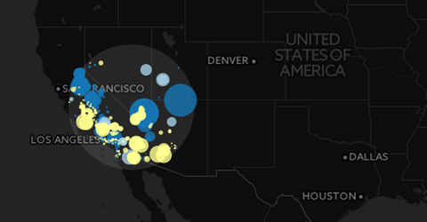
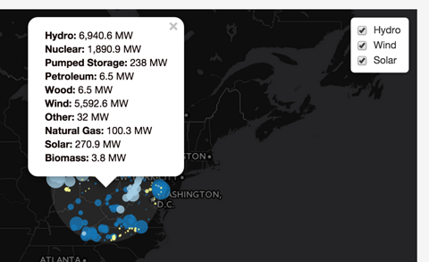

# Lab 09: Making an interactive bi-variate web map

**Scenario**:

You've been hired to make an interactive web map of US electric power generation. Your client would like users to be able to compare the power produced from *3 distinct fuel sources* of your choosing. At least one of these sources should be either Coal, Natural Gas, or Nuclear. The other two are up to you. The client has also given you the follow requirements the map should meet:

**Map requirements (which are also the suggested order for coding)**:

* shows power plant power generation using proportional symbol size to visually encode the amount of power produced from a *particular fuel source*  (**1pt**)
* allows the user to easily compare 3 distinct fuel sources (of any amount of generating capacity) by visually encoding the proportional symbols with distinct colors (i.e., make the symbol for each fuel source a different color). (**2pts**)
* provides the user with a layer control to toggle on and off the visibility of various power plant data layers (**1pt**)
* styles the label text within the layer control to correspond with the color used to encode a specific power fuel source (**1pt**)
* when the user *clicks* on the map once, the map display will change to only show plants within **500 km** of the click event (**2pts**)
* after the user *clicks* on the map to filter by distance and then clicks on any power plant currently visible, a popup will show specific information about the plant, including the **plant's name**, its **fuel source**, and the **distance from the plant to the the click point** (**3pts**)
* tailor the map for the client by providing appropriate title and other information.

You will use and adapt the code examples presented in Lessons 08 and 09 to solve this map assignment.  

**Map due date**: The client needs the final map submitted via Github and a link through the Canvas assignment no later than ***11:59pm on Thursday, March 18th***

**Additional Challenge #1**:

Enhance the map display so that upon clicking or double clicking, a "spotlight filter" circle shows the areal extent of the distance (i.e., 200km or 500km radius). You may style this circle however you deem appropriate, but note that the circle should be drawn so that it doesn't cover the proportional symbols and thereby disables their click to retrieve the popup functionality. The solution may look like this:

  
**Figure 01.** Spotlight filter showing extent of search.

**Additional Challenge #2**

Beyond displaying the spotlight filter circle, the client would also like to know some summary statistics from the area within that search filter. Modify the code so that, upon clicking on the map, the the aggregate amount of power for each fuel source is made available within a popup on the spotlight filter, opening immediately upon clicking or double-clicking on the map. The popup would look like this:

  
**Figure 02.** Summary statistics for the popup of the spotlight filter.

