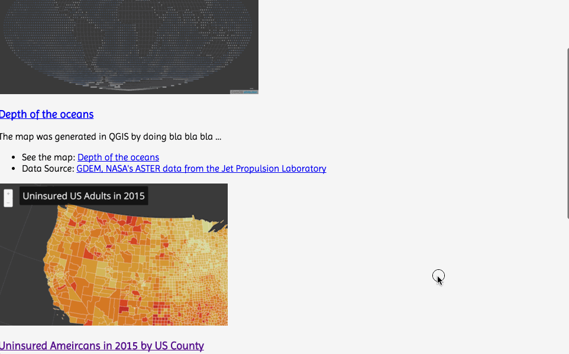

# Lesson 10: building a portfolio page and hosting

Within this lesson we're going to achieve two principle goals: 1.) creating and hosting an online portfolio page for sharing some of the maps created in MAP671 and MAP672, and 2.) using GitHub pages to serve web maps we've made. This lesson will guide you through building and customizing an HTML portfolio page from template and teach you how to host your maps on a remote web server (GitHub Pages).

## 1. Web hosting and creating a GitHub Pages repository for an online portfolio

So far, we've been developing our web maps locally and using GitHub repositories to host and share our code (and various other files).  But, the point of making web maps is to share them with the general public, *on the web*. How do we do this?

Specifically, we've been using a web *server* that Brackets runs to "serve" our web document within a web browser on our local machine. We need a web server available to "host" our projects as well, but one that is accessible to the broader public through a URL address (i.e., not our own laptops or the lab computers). While there are various web hosting companies that can provide you with web server space, GitHub fortunately offers this service as well. These are a special kind of GitHub repository, referred to as [GitHub Pages](https://pages.github.com/). 

While these repositories are similar to the ones we've been using to commit, backup, and share our code, the HTML documents within these GitHub Pages repositories will be "served" to the user as HTTP requests and rendered within their browser (rather than displayed as raw HTML text like our current repos do).

To create our GitHub Pages repository, we'll be following the instructions provided on GitHub's website: [GitHub Pages](https://pages.github.com/). We couldn't write these any clearer, so follow those steps.

When answering the question, *What git client are you using?*, you'll likely want to choose either "GitHub for Windows" or "GitHub for Mac.

For their step 3, *Create an index file,* you can simply use the starter *index.html* file provided within this module's *lesson-10-data/* directory, which contains the following HTML:


```html
<!DOCTYPE HTML>
<html>
<head>
<meta charset="utf-8">
<title>MAP672 Portfolio Example</title>

<meta name='viewport' content='initial-scale=1,maximum-scale=1,user-scalable=no' />

<style>
    
/* CSS style rules go here! */   

</style>
</head>

<body>

    <p>Hello World! I'm going to be a portfolio page.</p>
    
</body>
</html>
```

**Important:** This *index.html* file and its associated files will need to reside within the  new repository you create (i.e., not your MAP672 repository), a repository named **username*.github.io. Once you create this repository, you should copy the contents of the *lesson-10-data/* directory into the *username*.github.io repository &ndash; but not the *lesson-10-data/* directory itself!  &ndash;. You can then open that repository directory in Brackets, edit those files, and commit changes to your *username*.github.io repository.

## Building a portfolio page

This section will walk us through building a basic, single page HTML document that will serve as the main portfolio page for an online portfolio. While, when ready, we will be pushing this up to the remote GitHub (Pages) repository for deployment to the general public, it's still a best practice to develop and test these locally. When you sync these local commits with the GitHub remote repository in your GitHub pages, those changes are then live and viewable to the public.

In the previous section we created a new repository (*username*.github.io) in the web interface of GitHub, and then we pulled this repository to our local machine. We then created a file named *index.html* within that repository, added some minimal HTML, and then pushed that change back up to the repository. Now we will continue to edit that file to make a web portfolio page.

This module walks us through writing the HTML and CSS, and organizing some accompanying image files, to make a web page that will look something like this:

  
**Figure 1.** Example Portfolio Web Page Layout

While you may eventually use JavaScript to enhance the experience of using your web portfolio, for now we won't be writing any JavaScript. We're going to build this webpage solely using HTML and CSS.

### Thinking about the content for your portfolio

A good portfolio will demonstrate some of your best work and give a potential employer or client a sense of your strengths and skills. With a portfolio, less is more. Rather than showing every map you've produced, think back over the maps you've created in MAP671 and MAP672. Select a couple/few statics maps at most from MAP671. Perhaps you'd like to include one of the maps made with CartoDB (in which case all you need for that is the URL), and one or two from MAP672 (like from Modules 08 or 09).

We're going to create a single page portfolio that displays a smaller cropped image of the map, and then we'll link to either a downloadable full resolution version of the map (i.e., a PDF or PNG file produced in MAP671), or to a web hosted version of the web map (either the one hosted by CartoDB or created with a gh-pages branch of a GitHub hosted repository, discussed in Part 2 of this lesson).

Beyond simply showing an image of the map and providing a link to it, the portfolio page content can also demonstrate some of the knowledge, skills, and processes you're mastering. Consider writing succinct summaries of each of the products you're displaying, informing people of the design decisions and technical solutions required to reach the end product. 

It may also be advisable to list the data sources. Especially for the web maps, it's good to provide a link to the GitHub hosted codebase so people can enjoy reading all your fancy JavaScript!

Spend some time thinking about and gathering these assets before continuing on.

This lesson will demonstrate creating one for a static map image, one for the CartoDB hosted map, and one of the web maps.

### Creating structured content with HTML

So far throughout this course, we've written very little HTML. We've used basic `<h1></h1>` tags to describe the header titles for our maps. We've used `<footer></footer>` tags to enclose meta content within the web pages holding our maps. We've used a `<div></div>` tag with an id attribute of "map" (e.g. `<div id="map"></div>`) for holding our dynamically produced Leaflet web maps. 

We'll begin building our portfolio web document by structuring our content within HTML tags. Recalling what we learned in Module 02, we use HTML to structure (or "describe") our content, and we use Cascading Style Sheets (or CSS rules) to determine how that content is displayed, its "look and feel". This distinction is also the classic distinction between *content* (HTML) and *form* (CSS) made within design.

We'll begin writing our HTML directly beneath the opening `<body>` tag. For this example, we're going to have a main page title we'll enclose within the `<h1>` tag, as well as a subheading we'll enclose within a `<h2>` tag. For some styling purposes we'll see later on, we're also going to wrap both of these header tags within an HTML tag named `<header>`. So our HTML will look like this (further examples will omit the `<body></body>` tags, but understand that all HTML displayed on the webpage will be contained within these tags):

```html
<body>
<header>
    <h1>MAP672: Programming for Web Mapping</h1>
    <h2>Web Cartography at the University of Kentucky</h2>
</header>
</body>
```

You'll of course want to use your own name and some title to describe yourself or your work, such as "Matt Zook: Big Data Wrangler and Purveyor of Fine Iguanas." If we save these changes and refresh our browser (Brackets may be automatically updating these content changes as you enter them, which is super cool!), we see some basic unstructured HTML.

  
**Figure 2.** Un-styled header tags.

Now we want to think about how to describe the content we wish to display for each project. What do you want your content to say? Once we establish this, we can then think about what the appropriate HTML elements are used to describe this content. 

For this example, we want to entice our user to look at our map by showing them a nice image of the map (``). We also what a heading to serve as a subtitle for that map (`<h3></h3>`). Perhaps we want to offer the reader a couple paragraphs that describe what the map says or does (`<p></p>`), or to highlight some particular functionality or technology used, to grab the attention of a potential employer or client. We may wish to list some features as well (`<ul><li></li></ul>`) and/or provide links to the data sources or the code for the map hosted on our GitHub repo (`<a href="">`). Before we start entering in our content, we can build a snippet of HTML skeleton that we can then copy and reuse for each of our portfolio project entries. We'll so structure each of these entries within some `<section></section>` tags.

We can replace the `<p>Hello World! I'm going to be a portfolio page.</p>` code with the following, beneath the `<header></header>` content:

```html
<section>
    
    <h3></h3>
    <p></p>
    <p></p>
    <ul>
        <li><a href="" /></li>
        <li><a href="" /></li>
    </ul>
</section>
```

Remember that we can look up what all these HTML entities are and their intended purpose within a web document:

* [section](https://developer.mozilla.org/en-US/docs/Web/HTML/Element/section)
* [img](https://developer.mozilla.org/en-US/docs/Web/HTML/Element/img)
* [h3](https://developer.mozilla.org/en-US/docs/Web/HTML/Element/Heading_Elements)
* [p](https://developer.mozilla.org/en-US/docs/Web/HTML/Element/p)
* [ul](https://developer.mozilla.org/en-US/docs/Web/HTML/Element/ul)
* [li](https://developer.mozilla.org/en-US/docs/Web/HTML/Element/li)
* [a](https://developer.mozilla.org/en-US/docs/Web/HTML/Element/a)

Okay, now that we have the basic HTML structure for a section, let's start populating with our content. 

Let's deal with the image first. Since images aren't text (unless we're creating some fun ASCII art), we'll need to create screenshot images of our maps, crop and save these images into a directory, and then link to these images using the `src` attribute of our `` tag.

**1. Grab a screenshot of your map**

Depending on if you're using a Mac or a PC, the keyboard commands will be different. Consult online documentation and consider your options depending on your operating system:

* Screenshots on a mac: [https://support.apple.com/en-us/HT201361](https://support.apple.com/en-us/HT201361)
* Screenshots on Windows 8: [http://windows.microsoft.com/en-us/windows/take-screen-capture-print-screen#take-screen-capture-print-screen=windows-8](http://windows.microsoft.com/en-us/windows/take-screen-capture-print-screen#take-screen-capture-print-screen=windows-8)

Different options for capturing screenshots include saving them to file or copying them to the clipboard and then pasting into a photo-editing program.

**2. Crop and resize your image**

Remember that we're hosting these images on the web. The larger the image, the larger the file size, the longer it will take for your web page to load for your user. Furthermore, since an image screenshot may be very large (native resolution for a 15" Macbook with retina display is 2560 by 1600 pixels), it may be necessary to reduce the size of the file.

You may also wish to not show the entire map as this image, but focus on a particular area. Therefore, you may wish to crop it in some way.

There are various ways to crop and resize an images. You may use software applications such as Photoshop or Inkscape. There are also various online web applications that allow you to upload an image, crop/resize, and then download (try a Google search to find these).

**DID YOU KNOW!?!** Your tuition you paid for New Maps Plus included fees in support of software available to you as a student to download and use. Including in this software is Adobe Create Cloud Core 2015, which includes such industry standards as Photoshop, Illustrator, InDesign, Premiere. Go to [University of Kentucky Software Downloads](https://download.uky.edu/) and login with your Link Blue credentials.

For the layout of this design, we've chosen to display our images at a width of 388px and a height of 240px (which just happens to be the [golden ratio](http://en.wikipedia.org/wiki/Golden_ratio)). The size of your images is a design decision, and that is up to you.

Before saving your image to your working directory (i.e., your local GitHub Pages repository directory with the `index.html` file in it), create a subdirectory within it and name it *images*. Its a good practice to store media assets like images in their own directory. Save your image within this *images* directory.

**NOTE:** for the static image, you may simply be able to open your original, full-resolution map image in a program such as Photoshop or InkScape and export it as a smaller size (hint: Choose File -> Save for Web in Photoshop).

**3. Provide a relative link to the image within the HTML**

Once we've done that, we can then link to that image from within our HTML to display the image in the web document. It's also a good practice to provide a textual description of the image within the `<alt>` tags, which will describe the image to the user if the image doesn't display, as well as to those with who may be using a visual screen reader. Note that we are not using a closing (e.g., `</img>`) tag. The image tag is a special breed of HTML elements called "self-closing" tags, and does not require this. Update the HTML then using a relative path to the image and the alt text:

```html

```

Provided the image is saved to the correct directory, and we've given it the right path, our refreshed browser should now be displayed within the web page (note that we can see the bullets for the two empty list items):

  
**Figure 03.** Portfolio image displayed in the HTML document

Okay, now we're cooking with gas. Let's go ahead and create the content for the rest of the portfolio project entry:

```html
<section>
    
    <h3>Depth of the the oceans</h3>
    <p>This dot map is a highly abstract example of encoding ocean depths with deeper situation levels of a blue hue.</p>
    <p>The map was generated in QGIS by doing bla bla bla ...</p>
    <ul> 
        <li>See the map: <a href="#">Depth of the ocean</a></li>
        <li>Data Source: <a href="https://asterweb.jpl.nasa.gov/gdem.asp">GDEM, NASA's ASTER data from the Jet Propulsion Laboratory</a></li>
    </ul>
</section>
```

Note that we've provided a title for our map within the `<h3></h3>` tags, some textual description of the map within the `<p></p>` tags, as well as three links (making use of the anchor tag `<a>` using the `href` attribute). The result within the refreshed web document now looks like this:

  
**Figure 04.** Un-styled HTML content for a single portfolio project entry.

We've provided a relative link here to a file named *oceans-depth.png*, which resides in a directory named *images*. This is the low-res image we created for displaying within the page. We also want to give the user to see our larger map. Let's consider storing such images within another sub directory of this repository we'll name *maps*. Create this directory and then copy the full resolution images you'll like to share into this directory. We can then update the HTML so that the user can click on some link text and download the file.

Update the line with the link to your map to do this. In this example, there is a file named *ocean-depth.pdf* within a directory named *maps*:

`<li>See the map: <a href="maps/ocean-depth.pdf">Depth of the oceans</a></li>`

Also, it's a good idea to give the user multiple links to access your map (you really want them to click on the link and check it out!). So, we'll also wrap both the image of our map and the map title content within our `<h3></h3>` tags in `<a></a>` tags as well. We can also use the HTML attribute `target="_blank"` to open the map in a new page (or download it), so the user isn't directed away from our web page.

```html
<section>
   <a href="maps/ocean-depth.pdf"></a>
    <h3><a href="maps/ocean-depth.pdf">Depth of the oceans</a></h3>
    <p>The map was generated in QGIS by doing bla bla bla ...</p>
    <ul>
        <li>See the map: <a href="maps/ocean-depth.pdf">Depth of the oceans</a></li>
        <li>Data Source: <a href="https://asterweb.jpl.nasa.gov/gdem.asp">GDEM, NASA's ASTER data from the Jet Propulsion Laboratory</a></li>
    </ul>
</section>
```

Now that we've dialed in this section's content, we can copy and paste this chunk of code (including the `<section></section>` tags) for as many other projects as we'd like to share on this page. We just need to edit the content, produce a cropped and resized image for each (saved within the *images* directory), and ensure the paths provide valid links to any higher resolution image files we may include within the *maps* directory.

For our web maps hosted by CartoDB, we can provide a direct link to those. For example, the section for a map hosted through CartoDB's public service would look like this:

```html
<section>
   <a target = '_blank' href="https://rgdonohue.cartodb.com/viz/7a678fd6-88a7-11e5-8ee8-0e674067d321/public_map"></a>
    <h3><a target = '_blank' href="https://rgdonohue.cartodb.com/viz/7a678fd6-88a7-11e5-8ee8-0e674067d321/public_map">Uninsured Ameircans in 2015 by US County</a></h3>
    <p>The map was build using QGIS for X processing and used CartoDB CartoCSS styles to do Y and Z ...</p>
    <ul>
        <li>See the map: <a target = '_blank'  href="https://rgdonohue.cartodb.com/viz/7a678fd6-88a7-11e5-8ee8-0e674067d321/public_map">Uninsured Ameircans in 2015 by US County</a></li>
        <li>Data Source: <a target = '_blank'  href="http://www.countyhealthrankings.org/">County Health Rankings &amp; Roadmaps</a></li>
    </ul>
</section>
```

For our custom Leaflet maps produced in MAP672, we can simply use a placeholder `#` sign for the URL link address for now, and update those after we create the gh-pages branch for those (part 2 below). For instance:

```html
<section>
   <a target = '_blank' href="#"></a>
    <h3><a target = '_blank' href="#">Hello Kitty Proportional Symbol Map</a></h3>
    <p>This map was built with custom JavaScript code drawing upon the Leaflet JavaScript Library, bla bla bla</p>
    <ul>
        <li>See the map: <a target = '_blank'  href="#">Hello Kitty Proportional Symbol Map</a></li>
        <li>Data Source: <a target = '_blank'  href="https://www.eia.gov/electricity/data/detail-data.html">County Health Rankings &amp; Roadmaps</a></li>
    </ul>
</section>
```

Our webpage is now composed of beautifully structured content:

  
**Figure 05.** The un-styled HTML content for a portfolio page.

This is a perfectly valid, functional webpage, and completely accessible. However, it could use some style improvements to make it more aesthetically attractive and usable. Let's turn to some CSS rules now to improve this.

### Styling our HTML content with CSS

While it's tempting to say that these HTML elements are completely un-styled, this isn't quite correct. Notice how the `<h1>` content is larger that the `<h2>` content, and there's space between these? The actor links are colored blue and underlined. There's nothing in the HTML that's telling the browser to display them like this.

The web browser is actually applying its own default styles to these elements. All browsers do this, which is somewhat problematic, because browsers are not consistent with their default styles. For this reason, web pages end up looking very different across different browsers. It is therefore a good practice within web design to, before writing our own custom CSS style rules, to "reset" or "normalize" all the browser's default style rules. We do this by loading an external, remotely-linked style sheet. We recommend using [normalize.css](http://necolas.github.io/normalize.css/) for this.

We can copy the URL link to a CDN version of *normalize.css* and load it within the head of our document, before we start writing our our custome styles (i.e., before the `<style></style>` tags):

```html
<link rel="stylesheet" href="https://cdnjs.cloudflare.com/ajax/libs/normalize/3.0.3/normalize.min.css" />
```

If we refresh our browser, we can see some subtle changes in the presentation of the elements, that the normalize style rules have changed the default font style to sans-serif, for example:

  
**Figure 06.** The normalized HTML content for a portfolio page.

Now let's start writing our own CSS rules to select our various HTML elements and apply various properties to them. We'll do this to affect both the layout of elements in relation to each other, as well how they are displayed individually.

First, we'll write a rule that gets applied to the entire body of the document. Here we're giving the body a background color encoded with the hexadecimal value of `#f5f5f5` (our "whitesmoke" color). We're also assigning a *font-family* property to the body, which all elements will inherit, unless otherwise specified. Here, we're asking the browser to first attempt to use a typeface named *Imprima*, and if its not available, to use another sans-serif font (we could list as many fonts as we wish here). 

```css
body {  
    background: #f5f5f5;   
    font-family: Imprima, sans-serif;
}
```

But *Imprima* isn't a common font, so how do we know that the user's browser supports it? Before a couple years ago, we couldn't assume this, and webpages typically all supported the same set of common fonts. Fortunately, web fonts have greatly improved, in part thanks to  projects like [Google Fonts}(http://www.google.com/fonts), which make a wide array of web fonts available for use in web pages.

To help make our web page display the type in *Imprima*, we follow the instructions for including it in our document: [http://www.google.com/fonts#UsePlace:use/Collection:Imprima(http://www.google.com/fonts#UsePlace:use/Collection:Imprima)]. We've chosen the "Standard" method and linked to Google's style sheet within the head of our document, between our link for the normalize.css and our customer styles:

```html
<link rel="stylesheet" href="https://cdnjs.cloudflare.com/ajax/libs/normalize/3.0.3/normalize.min.css" />    
<link href='http://fonts.googleapis.com/css?family=Imprima' rel='stylesheet' type='text/css'>
<style>
    body {  
        background: #f5f5f5;   
        font-family: Imprima, sans-serif;
    }
</style>
```

A refresh of the page should now display the type in our typeface of choice.

Moving along, we'll next write three CSS rules to select our `<header></header>`, `<h1></h1>`, and `<h2></h2>` tags, and apply various styles to them. Notice that we're specifying a typeface named `Dosis` for the `<h2></h2>` tags. Again, this is not a typeface we can assume our user has installed on their machine, so we can grab it from Google and add it like we did with the *Imprima* font ([Dosis](https://www.google.com/fonts#UsePlace:use/Collection:Dosis)).

```css
 header { 
        width: 100%;
        min-width: 800px;
        margin: 0 auto;
        background: steelblue;
        padding: 15px 0 20px;
    }
h1 { 
    font-family: Dosis, sans-serif;
    color: #375671; 
    width: 80%;
    margin: 0 auto;
    color: whitesmoke;
}
h2 { 
    font-family: Dosis, sans-serif;
    color: #375671;
    width: 80%;
    margin: 0 auto;
    color: whitesmoke;
}
```

While this module will not exhaustively explain what each style property is doing, you should spend some time playing with the property values to see the results (Bracket's will live update these changes!), as well as read about these CSS properties. Again, reiterating what we spend time doing in Module 02, there are various web resources for learning about CSS rules: [Mozilla's CSS](https://developer.mozilla.org/en-US/docs/Web/CSS) and [W3CSchools](http://www.w3schools.com/css/) are always good for a quick reference.

One thing worth noting, however, is that by setting an element's width to a percentage (e.g., `width: 80%;`) and its margin's left and right values to `auto` (`margin: 0 auto;`), we both provide some space on either side of an element and center it as well. We've done that with the h1 and h2 tags (though the text is still aligned to the left).

The updated result from those style rules:

  
**Figure 07.** Web page with header styles applied.

Next, we'll select the elements we're using within each of our sections and style them:

```css
    h3 {
        font-family: Dosis, sans-serif;
        color: #003d71
    }
    p { 
        font-size: .9em; 
        color: #375671; 
    }
    ul {
        list-style-type: none; 
        font-size: .9em; 
        color: #375671; 
        line-height: 1.6em;
    }
    a, a:visited {   
        color: #003d71;
    }
```

The result of which we can see here:

  
**Figure 08.** Web page with section styles applied.

Next, we want to style the layout of the content within our sections. However, rather than directly selection the elements using their tag name (i.e., `<section>`), we'll first give these element class names within the HTML. Let's give each section a class attribute value of *project* and each of our images a class attribute value of *project-image* (remember we can apply class rules to multiple HTML elements). We'll write these attributes directory into our HTML:

```html
<section class="project">
    <!— HTML CODE REMOVED FOR THIS EXAMPLE —>
</section>
```

and

```html
<a href="maps/ocean-depth.pdf"></a>
```

Now, we can select these elements by their class name using our CSS:

```css
.project {
    width: 80%;
    min-width: 800px;
    height: 100%;
    margin: 35px auto;
}
.project:after{
    content: "";
    display: table;
    clear: both; 
}
.project-image {
    width: 388px;
    height: 240px;
    background: white;
    float: left;
    margin-right: 20px;
    border: 2px solid #dddddd;
}
```

Those rules apply that technique of limiting the width of the sections and using left and right margin values of "auto". Next, we apply a property called "float" to our image which will allow the other textual content contained within our h3, p, and ul elements to float to the side of it.

The CSS selector `.project:after` is applying a clever technique used to clear the float from the image so elements below it don't continue to wrap around it.

The result is now starting to look a bit better:

  
**Figure 09.** Completed Portfolio Web Page Layout

## Syncing changes and sharing your web portfolio with the world

Once you're satisfied with your work, you can sync up your commits to your GitHub Pages repository to see the results. Your portfolio should then be available from *username*.github.io. Remember to double check all your links to make sure they work properly.

There's only one problem. The links to your web map don't go to a working version of your web map. Let's get that figure out now!

## 2. Using gh-pages to serve maps from specific GitHub repositories

As we saw above, creating a repository with our GitHub username and ending it with *.gitihub.io* enables GitHub's servers to send files within that repository directory as HTTP requests ... in other words, to "serve" our HTML/CSS/JavaScript as a web page rather than merely a collection of text-based files.

GitHub also enables this same functionality for any repository, simply by creating a branch named *gh-pages*. Let's walk through a simple example.

While we could create a *gh-pages* branch on our MAP672 repository and share the maps we've made for our lab assignments from this repository, there are a couple problems with this. First, using the URL address of *rgdonohue.github.io/map672/module-08/lab-08/lab-08-data/index.html* isn't very cool. If the map is about US renewable power production, then we'd prefer a URL like *rgdonohue.github.io/us-renewable-energy/* (browsers will first look in any directory for a file named *index.html*, so there's no need to specify the *index.html*). 

Second, part of the reason we host our code and maps on GitHub is to enable collaboration. We want other people to fork our repositories and help make it better by editing the code and doing pull requests (in a similar way I've been doing with your grading). It's not desirable to people to clone or fork our entire map672 repository to make a small change in one file. Therefore, for our map projects we're most proud of and want to share, we'll instead copy them into a new GitHub repository and create a gh-pages branch from that master branch. I'll walk you through that process now.

Let's say for lab 08 I created a [Proportional Symbol Map of Hydro Power](http://bl.ocks.org/rgdonohue/80ef203479b5f65db8e5) using some silly Hello Kitty icons as the symbols. Again, these files may be buried deep within my course repository at *rgdonohue.github.io/map672/module-08/lab-08/lab-08-data/* . We'll want to copy this over to our new repository at the local level. But first we want to create this new repository in GitHub and clone that down to our machine.

First, login to your GitHub account in the browser. You'll want to create a new repository (using the small plus dropdown at upper right). Give your new repository a descriptive name (no spaces!). You can add an optional description. Importantly, check the "Initialize this repository with a README" option. This will help you clone your repo down easily.

  
**Figure 10.** Creating a new repository in GitHub.

After you've created this new repository (empty, other than the the README.md file automatically created by GitHub), you're ready to clone it down to your machine. You do this in the same way as you cloned the NewMapsPlus course repo and your own MAP672 repo to your local machine (refer to Lesson 01). You'll want to clone this down and save it to your local machine. You'll likely want to clone into the same directory as your saving your other GitHub repositories (but NOT inside the MAP672 directory).

Most of us are working in the GitHub Desktop client application. This process will look like this:

  
**Figure 11.** Creating a new repository in GitHub.

After that is complete we can go into our file/directory structure, examine our new repository directory, and then copy the contents of our working web application/map (including any necessary data and asset files) into the new repository.

  
**Figure 12.** Creating a new repository in GitHub.

Once we do this, we can check the Git status of our repository in GitHub desktop to verify there are new uncommitted changes to our repository. We can go ahead and commit these, and even sync up with our remove repository. We can refresh the page in our browser window to see we've added the new files to the repository and pushed them to the remote.

  
**Figure 13.** Creating a new repository in GitHub.

Again, these are simply the files being shown within GitHub's webpage as plain text files. But we want that *index.html* file served to the user as a web page. We're now ready to create our branch from the repository's master branch. The GitHub Desktop application offers us this functionality.

You may notice that your repo only has one branch, a *master* branch. Switch to your GitHub Desktop client and create a new branch (from the master), named *gh-pages*. Seriously!: no capital letters, no spaces, not an underscore instead of the hyphen. Create the branch, and then choose to **Publish** (or push, perhaps) the new branch to the repository. You can then switch back to the GitHub website, refresh the page, and verify that there are now two branches for this repository.

  
**Figure 14.** Creating a new repository in GitHub.

Now, just like the root level of the *username.github.io*, we can simply navigate to that URL in our browser and include the name of the new repository after that address (it doesn't matter if you switch to *master* or *gh-pages* in the GitHub web page).

  
**Figure 15.** Creating a new repository in GitHub.

In that example you may notice that the *rgdonohue.github.io* switched to *situatedlaboratires.net*. Don't mind this, as I have another domain name pointing toward my GitHub account.

Now that we have our map hosted and viewable by a public audience, we can return to our portfolio page built above and replace that temporary # symbol with the URL we just navigated to (e.g., *rgdonohue.github.io/prop-symbol-hello-kitty/*). Update your *index.html* file within your *username.github.io* directory with your URL, commit these changes to that repo and sync with the remote to verify the links work. Again, using the `target="_blank"` attribute will open your map in a new page, without leaving your portfolio page.

Finally, commit and push up any changes to your webpage. Test the remotely-hosted page in your web browser (including all the links!), 
